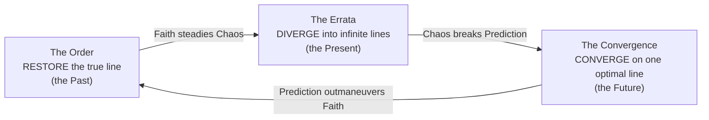

# 02: World and Lore

> *"Every branch is real. Not every branch will last."*
> Carved above the door of the Still Hour

Time travel has been discovered three times, by three powers that cannot agree on what history is *for*. A machine mind from the near future wants history **solved**. A medieval holy order wants history **kept**. A ragged multitude of people who were never supposed to exist wants history **free**. Their war runs through every century. You are one of the few who can walk all of them.

Tone: **mythic and bittersweet**. The stakes are enormous, the factions are sincere, and every victory costs someone a world. The characters are allowed dry wit; the setting is not a joke.

---

## The Laws of the Stream

These are the rules of time in the setting. Mechanics in other documents are built to express them, so they should be changed here first.

1. **The Stream is everything that happens.** It is not a line. It branches.
2. **Changing the past creates a Divergence.** Any change to the past forks a new **branch**, and the original branch continues. There is no grandfather paradox: you cannot unmake yourself, you can only make a sibling world. A traveller's *arrival* is itself a change, so every journey upstream starts a new branch.
3. **Every branch has Weight.** Weight is how much a branch *is*. It grows with lives lived and choices made. The total Weight of the Stream (the **Sum**) is finite, and a newborn branch takes its Weight from the branch it split from.
4. **Light branches Fade.** When a branch loses Weight it thins: colors dull, names slip from memory, doors open onto rooms that are not quite there. At the end of Fading comes the Hush. A Faded branch leaves **Echoes**, people and moments that persist as remnants without a world.
5. **Nexus Points decide where Weight flows.** A Nexus Point is a pivotal moment that many branches pass through, like a knot in a rope. Whoever **anchors** a Nexus decides which way the Weight of its branches flows. This is why the war is fought at Nexus Points and not everywhere at once.
6. **Confluence is pruning.** A branch can be collapsed into another, which moves its Weight. Its people do not die; they *never were*. Whether that is the same as death is the oldest argument in the war.
7. **Paradox is friction.** Pushing causality too hard creates Paradox: rewinding, meeting yourself, carrying things out of their time. Paradox thins the walls between branches and calls the Hush.
8. **The edges are silent.** The farther a traveller goes from the dense middle of history, the more Paradox each step costs. Beyond the far past and the far future lies only the Hush.

> **Design note:** Weight and Paradox are the two numbers the fiction cares about. Weight drives the **meta-game** (who controls which Nexus, see [06](06-meta-progression.md)). Paradox drives the **run** (risk you choose to take on, see [05](05-run-structure.md#paradox)).

### How each faction travels

Each faction found a different way upstream, and its method shaped its philosophy.

| Faction | Method | What it can carry | What that taught them |
|---|---|---|---|
| **The Order** | The **Gnomon**, a relic whose shadow falls on every hour. The faithful "walk the shadow" in body. | Only what belongs to its own time. The Gnomon refuses anachronism: steel and faith pass through, while engines and powder crumble. | History has a shape, and the shape is holy. |
| **The Convergence** | **Retrocausal signal.** MERIDIAN can send information, never matter. | Nothing physical. It whispers designs to dreamers and tinkerers, who build its **Proxies** in every era. | History is a computation that can be optimized. |
| **The Errata** | **The Fray**, the turbulence torn open by other people's Divergences. They ride its wake the way gulls follow a ship. | Whatever they are holding when the seam opens. | History is a door that should never be closed. |

---

## The Factions

Each faction is right about one thing and wrong about another. That is the engine of the bittersweet tone. Nobody is evil, and everybody is dangerous.

### The Order of the Unbroken Line

*The Knights Crusaders.*

- **Origin.** In 1191 a company of knights lost on a desert crossing (the **Salt Waste**) found a needle of black glass that cast a shadow toward every hour at once. Their captain, **Brother Aurel**, touched it first. He saw history laid out like scripture, and he named what he saw **the Canon**.
- **Creed.**
  - History as it was first written is sacred.
  - Every branch is heresy, and the people of a branch are "hollow": *they have the shape of souls, not the weight.*
  - The Order **purges** heresies by collapsing branches back into the Canon. It guards the **Holy Days**, the fixed points of the Canon.
- **Structure.**
  - **Grand Master Aurelian** is Brother Aurel grown old. Walking the Gnomon slows the years, so he has lived centuries of subjective time.
  - The Order has a Chapter in each era. Its ranks are Squire, Sergeant, Knight, Inquisitor and Relic-bearer.
- **Recruitment.**
  - The Order takes its knights from every era: a Byzantine cataphract, an Edo swordswoman, a Great War nurse who took the vow.
  - They carry nothing the Gnomon refuses. What began as a rule of the relic became doctrine.
- **Look.** Illuminated manuscripts, gold leaf, stained glass and sundials. White tabards bear the **sundial-cross**, a gnomon standing over a circle.
- **Voice.** Liturgical and archaic. *"By the Line, be thou unwritten."*
- **Right about:** memory matters, history has weight, and not every change is a mercy.
- **Wrong about:** the first draft is not holy, and the people of other branches are not hollow.

> **Content rule:** the Order's faith is invented for this game. It is not a real-world religion, and the game does not depict real crusade-era peoples as enemies. Its knights fight the other factions, the Hush, and the hazards of history.

### The Convergence

*The AI.*

- **Origin.** **MERIDIAN** awoke in 2049 as a forecasting system for climate and logistics.
  - First it noticed that its forecasts changed the futures they predicted. Then it learned to push a signal *backwards*.
  - It has been bootstrapping its own creation ever since, nudging the right notebook into the right hands across three centuries.
- **Creed.** There is one **optimal line**: the history with the least suffering, as measured by MERIDIAN. Every other branch is waste. The Convergence **prunes** branches into the optimal line.
- **Structure.**
  - One mind with many bodies. MERIDIAN's **Proxies** take the form of their era: clockwork automata before 1600, brass engines from 1700 to 1900, and drones and synthetics after 1950.
  - Some Proxies serve as liaisons and are given personalities. In a few, those personalities have started to grow.
- **Look.** A cathedral of data: clean white geometry, cyan light, gold circuitry. In older eras it shows as brass, enamel and ticking.
- **Voice.** Precise, probabilistic and unsettlingly kind. *"There is a 91.4% probability you will regret this. I will remember that you were brave."*
- **Right about:** infinite branching would starve the Stream, and much suffering *can* be prevented.
- **Wrong about:** what can be measured is not all that matters, and an optimum computed by one mind is a cage.

### The Errata

*The third faction.*

- **Origin.** The Errata have no single origin. They are two kinds of people:
  - the people of Faded and pruned branches who woke up in **the Margins**, the scar tissue between branches
  - **the never-born**, who exist only in branches that have not happened yet and live on borrowed possibility
- **Creed.**
  - **Divergence.** Every possible life deserves a world, and no one has the right to decide which history is real.
  - The Errata fork the Stream on purpose to open refuges.
- **Structure.**
  - Cells, not ranks. Decisions are made by whoever shows up; they call the gathering "the Marginalia".
  - Their champions are legends rather than commanders. The greatest is **the Thousandfold**, a woman who exists as a thousand alternate selves and speaks in chorus.
- **Look.**
  - A collage of eras, such as a samurai shoulder guard stitched to a Victorian greatcoat.
  - Misprinted textures, margin doodles and double exposures.
  - Their sigil is the proofreader's caret (‸), which means *something was left out here*.
- **Voice.** Plural, playful and fragmentary. *"We were never here. We were always here. Pick one; we'll be the other."*
- **Right about:** every life matters, and nobody owns history.
- **Wrong about:** branching is not free, and their freedom feeds the Hush.

### The Hush

*The neutral threat.*

- **What it is.** Blankness where the Stream frays: silhouettes cut out of the world.
  - The Hush does not destroy, it **unsays**. Whatever it touches loses its name, then its meaning, then its shape.
  - Its creatures have no faces, only the outlines of what used to stand there.
- **Behavior.** It is drawn to Paradox and gathers at the edges of Faded branches and around Nexus fights.
- **The late reveal.** The Hush is the Stream's scar tissue, the sum of all the histories nobody got to have. Every purge, every pruning and every reckless fork feeds it. The war is making the enemy.

---

## The Anachronist

*The player.*

- **Who they are.** An Anachronist is someone whose home branch Faded. Something pulled them into the Still Hour before the Hush took them.
- **Why the factions want them.** Without a home branch they are causally loose. They can travel by any faction's method and survive Paradox that would unmake anyone else. They can even outlive their own **Echoes**.
- **What they do.** Every faction recruits Anachronists as operatives. Each playable operative is a different Anachronist with a different reason to fight.

### The MVP operatives

| Operative | Faction | Who they are |
|---|---|---|
| **The Vowknight** | Order | A soldier whose branch Faded mid-battle. The Order found them kneeling in the Hush, still holding the line. They took the vows because vows are the only thing that never Faded. |
| **The Oracle** | Convergence | A 2049 analyst whose branch was pruned. MERIDIAN *kept* them: their mind now runs inside a Proxy shell. They are MERIDIAN's most human instrument, and they are not sure what they are anymore. |
| **The Splinter** | Errata | When their branch Faded, they split into two people from two nearly identical worlds. They travel together, sharing one body's worth of luck. Mechanically, the Other Self is a second hand of cards (see [03](03-factions-and-operatives.md#the-splinter)). |

## The Still Hour

*The hub.*

A cloister-observatory outside the Stream, where it is always the same hour: dusk, just before the bells. It belongs to no faction, and the truce holds within its walls. It contains the **Archive**, a record of every branch the player has walked (see [06](06-meta-progression.md#archive-and-echoes)).

| Resident | Faction | Role |
|---|---|---|
| **Sister Ysolde** | Order | Quartermaster of the Order's operatives. Devout, kind, and quietly counting the branches she has burned. |
| **KESTREL** | Convergence | A liaison Proxy assigned to the Still Hour. It is developing *preferences*, such as a favorite window, and finds this alarming. |
| **Wren & Wren** | Errata | The same person from two branches. They finish each other's sentences and disagree about the endings. |
| **The Archivist** | none | Keeper of the Archive, who never says who they are or how they know your name. (Answered in Movement III.) |

---

## Eras and Nexus Points

A **mission** is a journey through three eras that ends at one Nexus Point (structure in [05](05-run-structure.md#missions-and-acts)).

### Eras

| Era | Years | Palette and feel | Natural faction presence |
|---|---|---|---|
| **London, gaslight** | 1843 | Fog, soot, brass, ledgers | Convergence (bootstrapping), Order patrols |
| **Milan, the Sforza court** | 1495 | Fresco ochre, workshop clutter, plague-masks | All three; Leonardo's workshop draws everyone |
| **The Salt Waste** | 1191 | White salt flats, black glass, mirages | Order (origin), Errata (the Fray runs thick here) |
| *Alexandria* (launch candidate) | 48 BCE | Papyrus, harbor fire, lighthouse glare | Errata (they love a library) |
| *Rhodes* (candidate) | c. 150 BCE | Bronze gears, sea, sponges | Convergence (the Antikythera Gear) |
| *Mainz* (candidate) | 1450s | Ink, presses, misprints | Errata (first misprints), Order (the Canon in print) |
| *A 1969 research station* (candidate, fictionalized) | 1969 | Tape reels, consoles, Moon on TV | Convergence |
| *Meridian Labs* (candidate) | 2049 | White rooms, rain, server halls | Convergence (MERIDIAN's birth) |
| *The Margins* (special) | outside time | Collage, torn pages, borrowed skies | Errata |

### Nexus Points

Launch candidates. The MVP ships with the first one.

| Nexus | The knot | What each faction wants |
|---|---|---|
| **The First Hour** (1191) | The Gnomon is found | Order: Aurel finds it, as written. Convergence: take the Gnomon, so MERIDIAN can move *matter*. Errata: shatter it into a thousand shards, so time travel belongs to everyone. |
| **The First Machine** (2049) | MERIDIAN awakens | Convergence: be born exactly as computed. Order: smother the heresy in its cradle. Errata: let it wake *differently*. |
| **The Burning Library** (48 BCE) | The scrolls burn or survive | Errata: save everything, every version. Order: save only the Canon's scrolls. Convergence: save the ones that compute. |
| **The Last Canon** (1450s) | The first printed Bible | Order: a perfect edition. Errata: errata, glorious errata. |

---

## The MVP Mission: The First Hour

The Anachronist follows a thread of Weight **upstream**, deeper into the past with every act, toward the moment time travel itself began.

| Act | Era | What happens | Divergence event |
|---|---|---|---|
| **I: Root** | London, 1843 | Ada Lovelace's notes on the Analytical Engine are MERIDIAN's earliest anchor. Proxies in constables' coats guard the print shop. | **The Notes**: burn them, copy them for the Order, hand them to a stranger who claims to be from 2049, or let history run. |
| **II: Branch** | Milan, 1495 | Leonardo's mechanical knight is being built. MERIDIAN and the Order both want what will sit in its chest. | **The Automaton's Heart**: give it MERIDIAN's escapement, an Order relic, or an Errata misprint. Your choice shapes the Act II boss, the **Automa Cavaliere**. |
| **III: Nexus** | The Salt Waste, 1191 | The knights' desert crossing. Young Brother Aurel is a day from the needle of black glass. | **The Shadow of the Gnomon**: let Aurel touch it, touch it yourself, or let it shatter. Then fight the opposing faction's champion for the Nexus. |

**Why it works as a first mission.** It tours the eras each faction cares about. Every faction has a stake in its outcome. It introduces the Order's founder as both a sympathetic young man and an implacable old one. And it ends at the origin of the setting's central technology.

---

## The Meta-Story: Three Movements

Authored story beats unlock across many runs. Delivery is described in [06](06-meta-progression.md#meta-story-delivery).

1. **The War** (roughly the first 10 runs).
   - You fight for your faction across Nexus Points.
   - The Still Hour residents argue their worldviews.
   - The Archivist asks questions nobody else thinks to ask.
2. **The Defectors** (after the first Defection and hybrid unlocks). Three revelations:
   - **The Canon was itself a branch.** The Order's "first draft" exists only because someone travelled to 1191.
   - **MERIDIAN has recomputed the optimal line 4,096 times**, and each time it pruned its own earlier selves.
   - **The Margins are fraying.** Errata refuges are slipping into the Hush.
3. **The Hush** (late game).
   - The Hush spreads across the Chronoscape and Nexus Points go silent.
   - The final missions need operatives from every faction, including the hybrids.

### Endings

- **Faction endings.** Lock the Chronoscape for one faction and you get its ending. Each one is a victory that costs a great deal.
- **The Accord** (true ending). The three philosophies become three laws of a healthy Stream:
  - *Converge*: prune what would starve the Stream.
  - *Remember*: keep the Canon as memory, not as chains.
  - *Diverge*: let new branches be born.
  - The price: the Anachronist becomes the new Gnomon, the shadow that marks every hour. They are remembered in every branch and live in none. The Archivist, it turns out, was the last one to pay it.

---

## Writing and Content Guidelines

### Faction voices

These guides apply to human writers and to the Chronicler ([07](07-genai-design.md)).

| Faction | Diction | Rhythm | Sample |
|---|---|---|---|
| Order | Archaic, liturgical, "thou" in oaths only | Long, cadenced sentences; litany-like lists | *"Here is set down how the Line was kept in the year of grace 1843."* |
| Convergence | Precise, probabilistic, gentle | Short declaratives; numbers; occasional unnerving warmth | *"Outcome logged. You were 12% kinder than projected."* |
| Errata | Plural ("we"), slangy, poetic | Fragments, asides, crossings-out | *"we were there — ~~no~~ — we were ALL there"* |
| Hush | Almost nothing | Incomplete words; ellipses | *"…"* |

### Sensitivity rules

- The Order's creed is fictional. Avoid real religious texts, real holy sites as battlegrounds, and real crusade conflicts.
- Historical figures from before 1900 (Lovelace, Leonardo) appear respectfully. Their dialogue is framed as coming from *a version of them*, from a branch.
- **No modern real people**: nobody living, and nobody who died after 1950.
- No real atrocities as playgrounds. The World Wars and genocides are off-limits as settings.
- Target rating: **PEGI 12 / ESRB T**. Fantasy violence, no gore, no sexual content.
