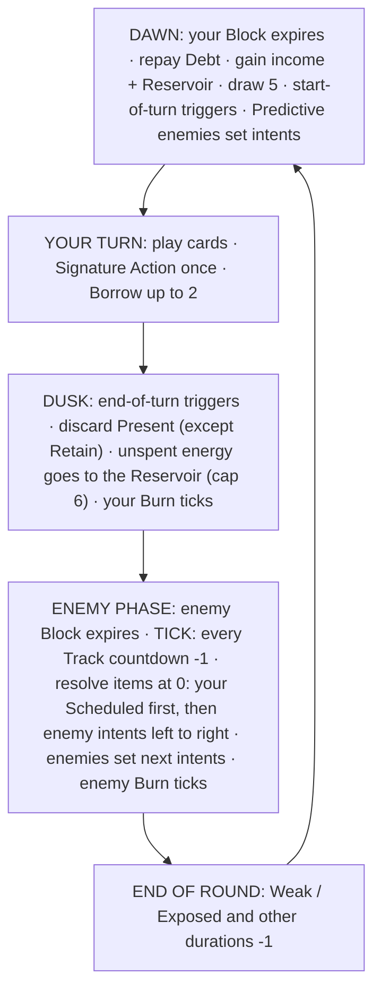

# 04: Combat

Combat is turn-based: one Anachronist against 1–4 enemies. The core loop is the familiar deckbuilder one, refined from Dawncaster (DC): draw, spend energy, play cards. What is new is **the Track**, a timeline that you and your enemies share. On it you can see when every threat will land, and you can bend it.

All numbers here are **starting values for the prototype**. Tuning happens with simulation bots and playtests ([09](09-tech-architecture.md#testing-and-qa)).

---

## At a Glance

- You **draw 5** cards each turn.
- Your **income is 3 energy** each turn: 2 of your faction's color and 1 **Neutral**.
- **Unspent energy carries over** into your **Reservoir** (cap 6). This is DC's best idea, kept.
- **You can Borrow up to 2** energy from next turn, which becomes **Debt**, plus 1 interest the first time each turn. Energy moves both ways in time.
- **One free Signature Action** per turn, like DC's basic attack, defined per operative.
- **Enemy intents sit on the Track with countdown clocks.**
  - **Delay** pushes a threat later, but every Delay adds **Pressure** and makes it hit harder.
  - Bosses' signature moves are **Fixed** and cannot be moved.
- **Your own effects can be Scheduled** onto the Track, and they resolve *before* enemies act.

---

## Zones

Every zone has a temporal name. The names are flavor *and* rules text, because faction mechanics are anchored to them.

| Zone | Classic name | Notes |
|---|---|---|
| **The Future** | Draw pile | Face-down. Cards seen with Foresee become **Known**. |
| **The Present** | Hand | Max 10 cards. Extra draws go straight to the Past. |
| **The Past** | Discard pile | Played and discarded cards. **Remember** counts it. |
| **The Erased** | Exhaust pile | Gone for the rest of combat. |
| **Constants** | In play | **3 slots** for persistent cards: Vows, Relics and Subroutines. Playing a 4th replaces one of your choice, and the replaced card goes to the Past. A replaced Vow doesn't count as broken. |
| **The Track** | (new) | The shared timeline of enemy intents and your Scheduled effects. |
| **The Other Hand** | (Splinter only) | 3 face-up cards held by your Other Self. You can't play them, they aren't discarded at Dusk, and at Dawn the hand refills to 3 from the Future. **Shift** swaps cards between the Present and the Other Hand. |

**Reshuffle.** When you need to draw and the Future is empty, shuffle the Past into the Future. All **Known** marks are cleared, and Remember counts drop to zero. Order decks care about this a lot.

---

## Round Structure

A **round** is your turn followed by the enemy phase. Durations measured in rounds tick at the very end of the round.



### Dawn (start of your turn)

1. Your Block expires.
2. **Debt is repaid.** Your income is reduced by your Debt, starting with the color you Borrowed, then your other colors.
3. Gain your income and add your Reservoir to it.
4. Draw 5. The Splinter also refills the Other Hand to 3.
5. Start-of-turn triggers resolve, including Constants and Afterimages.
6. **Predictive** enemies (Convergence) set their intent now, reading your Present.

### Your turn

- Play cards in any order and pay their costs.
- Use your **Signature Action** once. It's free.
- **Borrow** if you need more energy (see [Energy](#energy)).

### Dusk (end of your turn)

1. End-of-turn triggers resolve (for example, Subroutines).
2. Discard your Present, except cards with **Retain**.
3. Unspent energy flows into your **Reservoir**, up to 6. Any excess evaporates, and the UI shows it fading.
4. Your Burn and Plate resolve.

### Enemy phase

1. Enemy Block expires.
2. **Tick.** Every item on the Track counts down by 1.
3. **Resolve** everything that reached 0:
   - **your Scheduled effects first**, in the order you scheduled them
   - **then enemy intents**, left to right
4. Each enemy whose intent resolved sets its next intent with a new countdown. Predictive enemies wait until Dawn.
5. Enemy Burn and Plate resolve.

---

## Energy

### Colors

Every color also has a **shape**, so color is never the only signal.

| Energy | Faction | Pip shape |
|---|---|---|
| **Faith** (gold) | The Order | ☀ sunburst |
| **Compute** (cyan) | The Convergence | ⬡ hexagon |
| **Flux** (violet) | The Errata | ◎ spiral |
| **Neutral** (white) | income only | ○ ring |

### Costs and paying

- **Notation.** `1F+1` means one Faith pip plus one generic pip. `2C` means two Compute. `1` means one generic. `0` is free.
- **Colored pips** must be paid with that color.
- **Generic pips** can be paid with any energy, including Neutral.
- **Neutral** energy can only pay generic pips. It exists to create the **Attuned** decision.

### Income

- Each operative has a fixed income of **2 faction-colored + 1 Neutral** per turn.
- **Defection** ([05](05-run-structure.md#shrines-and-defection)) replaces the Neutral with your new faction's color, giving 2 primary + 1 secondary.

### Attuned

A card with **Attuned** gets its bonus if its **entire cost** was paid with its own faction's energy, generic pips included.

> Example: Line Strike costs `1`. Pay it with Faith and it is Attuned (+2 damage). Pay it with Neutral and it isn't. Each turn you decide which cards get your precious colored energy.

### Reservoir and Borrow

- **Reservoir.** Unspent energy of any color carries over to your next turn, up to **6** stored.
- **Borrow.**
  - During your turn you may spend up to **2 energy you don't have**. It must be a color in your income.
  - That amount becomes **Debt** and is subtracted from that color's income at your next Dawn.
  - **Interest.** The first time you Borrow in a turn, you owe 1 extra: Borrow 1 and owe 2, Borrow 2 and owe 3. Borrowing every turn is therefore a real cost, not a free shift.
  - Debt never exceeds 3.
  - Debt you still owe when a combat ends carries into your next combat and is repaid at its first Dawn. Borrowing to finish a fight is still often right, but it isn't free.
- **Rationale.** DC caps carryover at 8. We start lower (6) because Borrow adds flexibility in the other direction. Together they make energy a resource you move through time: save it, or take it from tomorrow.

> **Progressive disclosure:** the Reservoir is active from the first fight. The Borrow button unlocks on your third run, with a one-screen tutorial.

---

## Signature Actions

Each operative has a free action, usable **once per turn**. Many cards, Relics, Imprints and Artifacts modify it. This is the successor to DC's basic attack.

| Operative | Signature | Effect |
|---|---|---|
| Vowknight | **Strike** | Deal 4 damage. |
| Oracle | **Forecast** | Foresee 2. |
| Splinter | **Shift** | Shift 1: swap one card between your Present and your Other Hand. |

---

## The Track

The Track is the heart of the game's identity. It is one visible timeline holding:

- **Enemy intents:** what each enemy will do, and when.
- **Your Scheduled effects:** what you have set in motion.

### Countdowns

- Every item on the Track has a **countdown**: the number of enemy phases until it resolves.
  - **①** resolves in the coming enemy phase. It is the default for most enemy attacks, so enemies still act every round.
  - **②** and **③** are charging moves, like a cannon being loaded or an Inquisitor raising the Gnomon. You can see them coming.
- In each enemy phase, all countdowns drop by 1. Items at 0 resolve, **yours first**.

### Delay and Pressure

- **Delay N** adds N to an item's countdown.
- A Delayed **enemy intent** gains **1 Pressure per point of Delay**. Each Pressure increases the intent's numbers by **+25%**, rounded up. Pressure resets when the intent resolves.
- **Why Pressure exists.**
  - Postponing a problem makes it bigger. That is good fiction, and it prevents the degenerate "delay forever" lock.
  - Delay becomes a real decision: buy a round now, then block it, kill the enemy, or Delay again at a growing price.

### Accelerate

**Accelerate N** reduces a countdown by N, to a minimum of 1. It is mostly used on your own Scheduled effects, so they land sooner. It can also pull an enemy's harmless setup move forward.

### Fixed

**Fixed** items can't be Delayed or Accelerated. Every boss has one Fixed signature move, which keeps boss fights about *preparing*, not *stalling*. Fixed moves are marked with a lock icon.

### Scheduled effects

- A card with **Schedule N** places its effect on the Track instead of resolving it now.
- Scheduled effects are cheaper per point of power. A delayed punch is a discounted punch (see [08](08-card-dsl.md#modifiers)).
- They resolve **before** enemy intents in the same enemy phase. That timing lets you land a Block right before a big hit.
- Some enemies can **Disrupt** (Delay) your Scheduled effects. Your items never gain Pressure.

### Multiple intents

Elites and bosses may hold two intents on the Track at once, for example a jab every round plus a charging Fixed finisher.

---

## Enemies and Intents

### Intent types

| Intent | Icon | Meaning |
|---|---|---|
| Attack N | sword | Deal N damage (×hits) |
| Guard N | shield | Gain N Block (lasts until the next enemy phase starts, so it protects them during your turn) |
| Buff | arrow-up | Gain Might, Plate, etc. |
| Debuff | broken pip | Apply Weak, Exposed, Glitch, etc. |
| Summon | portal | Reinforcement arrives through the Weave |
| Charge | hourglass | A multi-round windup (countdown ②+) |
| Disrupt | crossed clock | Delay your Scheduled effects |
| Unpick | torn edge | Tear effects on what you are about to draw: Blank or Erase the top card of your Future |

### Faction behavior

Enemy behavior is how the faction triangle shows up in combat.

| Enemy faction | Signature behavior | Natural counter |
|---|---|---|
| **The Order** | **Fixed** charging hits, Plate, slow and heavy | Precise planning (Convergence: Foresee and Scheduled timing) |
| **The Convergence** | **Predictive** intents set at Dawn by reading your Present, plus Disrupt | Changing your hand after they read it (Errata: Shift and Fork) |
| **The Errata** | **Forked** intents with two possible outcomes, plus Doubles that copy your last card | Steady defense that covers both outcomes (Order: Block, Plate, Vows) |
| **The Tear** | Unpick: Blank or Erase the top of your Future; Snip your Constants | Big decks, Recall, killing them fast |
| **Era natives** | Straightforward attackers, like bandits, constables or plague-doctors | Anything |

- **Forked intents.** These show both outcomes, for example *A: Attack 14 / B: Weak 2*. Each has a 50% chance unless the intent says otherwise. The outcome is rolled when the intent resolves. Some cards **Observe**, which collapses a Forked intent to its rolled outcome early.
- **Predictive intents.** At Dawn, after you draw, a Predictive enemy reads your Present and picks its intent. For example: *"If your Present holds more Attacks than Skills: Guard 8 and Attack 6. Otherwise: Attack 10."*

---

## Keywords

The glossary is capped at **25 keywords** at launch. Long-pressing any keyword on any card shows its rules text, a DC strength we keep.

| Keyword | Family | Rules |
|---|---|---|
| **Block** | Universal | Prevents that much damage. Your Block expires at Dawn; enemy Block expires at the start of the enemy phase. |
| **Retain** | Universal | Not discarded at Dusk; stays in your Present. |
| **Erase** | Universal | After it resolves, this card goes to the Erased for the rest of combat. |
| **Schedule N** | Universal | The effect goes on the Track with countdown N instead of resolving now. Scheduled effects resolve before enemy intents. |
| **Delay N** | Universal | Add N to a Track item's countdown. An enemy intent gains 1 Pressure per point (+25% each). |
| **Accelerate N** | Universal | Subtract N from a Track item's countdown (minimum 1). |
| **Foresee N** | Universal | Look at the top N cards of your Future. Put any on the bottom and the rest back in any order. Those cards become Known. |
| **Recall N** | Universal | Return N cards of your choice from your Past to your Present. |
| **Attuned** | Universal | Bonus if this card's entire cost was paid with its faction's energy. |
| **Afterimage** | Universal | At your next Dawn, this card's effect resolves again at half value (rounded down). |
| **Fixed** | Universal | Can't be Delayed or Accelerated. |
| **Vow** | Order | Constant. States a restriction and a benefit, and you get the benefit while you keep it. Doing the restricted thing breaks the Vow: it is Erased and you suffer **Penance** (lose 4 HP). |
| **Relic** | Order | Constant. Equipment that modifies your Signature Action or grants a passive. |
| **Remember N** | Order | Bonus if your Past holds at least N cards of the stated kind. |
| **Litany** | Order | Bonus if the previous card you played this turn was of the stated kind. |
| **Martyr** | Order | Triggers the first time you lose HP in each enemy phase. |
| **Calculated** | Convergence | Bonus if this card is Known, meaning you Foresaw it before drawing it. |
| **Iterate +N** | Convergence | Each time you play this card this combat, its main number grows by N. |
| **Subroutine** | Convergence | Constant. Runs its effect at the stated time each turn. |
| **Compile** | Convergence | Merge this card with another card in your Present into a **Program**: one card with both effects, costing their combined cost −1, Erased after play. |
| **Fork** | Errata | Two faces; choose one when you play it. An effect that Forks a card gives it a temporary **Misprint face** for this combat (if the card already has two faces, draw 1 instead). Branch Variants from the Forge are permanent second faces ([08](08-card-dsl.md#the-forge)). |
| **Shift N** | Errata | Swap N cards between your Present and your Other Hand. With no Other Hand, swap with the top card of your Future. |
| **Paradox** | Errata | Gain or spend Paradox, the run-wide meter ([05](05-run-structure.md#paradox)). At 10 the timeline **Unravels**. |
| **Misprint** | Errata | When drawn, this card becomes one of its printed alternate faces at random (long-press to see all of them). |
| **Bleed-through N** | Errata | Add N random cards from another faction's pool to your Present. They cost 1 less this turn, any energy pays their colored pips, and they are Erased after play. |

**Rules terms that are not keywords:** Pressure, Known, Constant, Penance, Program, Predictive, Forked intent, Observe, Unravel. Each is defined in this document or in [05](05-run-structure.md). All of them are listed in the [glossary](README.md#glossary).

---

## Statuses

| Status | Applies to | Effect |
|---|---|---|
| **Might N** | anyone | Attacks deal +N damage (whole combat). |
| **Plate N** | anyone | At the end of its owner's turn (Dusk for you, end of enemy phase for enemies), gain N Block. Loses 1 stack whenever its owner takes unblocked attack damage. |
| **Weak N** | anyone | Deals 25% less attack damage for N rounds. |
| **Exposed N** | anyone | Takes 50% more attack damage for N rounds. |
| **Burn N** | anyone | At the end of its owner's turn, lose N HP, then Burn −1. |
| **Slow** | enemies | Its next intent gets +1 countdown when set, with no Pressure. |
| **Glitch N** | you | Your next N cards cost +1 generic. |

### Card states

| State | Meaning |
|---|---|
| **Known** | Seen via Foresee. Cleared on reshuffle. |
| **Blank** | Its thread cut by the Tear. Can't be played. Restored when your Past is reshuffled into your Future (the thread re-knits), and after combat. |
| **Misprinted** | Showing a temporary alternate face for this combat. |

### Card types

- **Attack**
- **Skill**
- **Constant:** Vow, Relic or Subroutine (3 slots)
- **Hazard cards:** added by enemies or Unravel, for example a Loose Thread, which is unplayable and Erases itself at Dusk.

---

## Damage: Order of Operations

1. Start with the base value.
2. Add **Might**.
3. Multiply by **Pressure**: ×(1 + 0.25 × Pressure), rounded up. This step applies to enemy intents only.
4. Multiply by 0.75 if the attacker is **Weak**.
5. Multiply by 1.5 if the target is **Exposed**.
6. Round down.
7. **Block** absorbs the damage first, and the rest is lost as HP.

---

## Edge Cases

The Phase 1 prototype had to settle these. The engine and its tests follow this table.

| Situation | Rule |
|---|---|
| An effect has no legal target, such as a Delay when only Fixed intents are on the Track | You can still play the card, and that effect does nothing. When there are several legal targets, you choose. |
| Paradox reaches 10 in the middle of a card | Unravel resolves at once, then the rest of the card resolves. Paradox never goes above 10. |
| Glitch and cost changes | Glitch adds a generic pip. A cost reduction removes generic pips first, then colored ones. |
| The Double copies your last card | It copies the printed damage (or Block), before Attuned and other bonuses. |
| Choices while a card resolves | Targets, Recall picks and Shift pairs are chosen when you play the card. Foresee is the only choice that pauses a card. |

---

## Worked Examples

### Example A: Vow, Remember, Litany and Borrow

**Situation.** The Vowknight is at 58/75 HP in round 3.

- **Constants:** *Vow of the Sword*. While kept, Strike deals +4. It breaks if you play a second Skill in a turn.
- **Energy at Dawn:** income 2F + 1N, plus 1F in the Reservoir, for **3F + 1N** available.
- **Present:** Line Strike, Line Strike, Remembered Blow, Litany of Steel, Shield of the Line.
- **Past:** 6 cards, including 3 Attacks.
- **Enemies:**
  - **Brass Proxy** (Convergence, 26 HP, Predictive). At Dawn it saw 3 Attacks against 2 Skills, so its intent is **Guard 8 + Attack 6** ①.
  - **Misprint** (Errata, 26 HP). Its Forked intent is **A: Attack 14 / B: Weak 2** ①.

| # | Action | Paid with | Result |
|---|---|---|---|
| 1 | **Strike** on Misprint | free | 4 + 4 (Vow) = 8 → Misprint 18 |
| 2 | **Remembered Blow** on Misprint | 1F + 1N | 9, +5 for Remember 3 Attacks = 14 → Misprint 4 |
| 3 | **Line Strike** on Misprint | 1F (Attuned) | 5 + 2 = 7 → Misprint dies, and its Forked intent leaves the Track |
| 4 | **Litany of Steel** | 1F | Gain 4 Block. Litany triggers (previous card was an Attack): draw 1, which is *Hold the Hour*. That is 1 Skill played this turn. |
| 5 | Out of energy. Shield or Hold the Hour would be a 2nd Skill and break the Vow (Penance 4 HP). **Borrow 1F** and play the other **Line Strike** on the Brass Proxy instead. Its Guard hasn't resolved yet, so hitting it *now* is efficient. | 1F borrowed (Attuned) | 7 → Proxy 19. Debt 2: 1 borrowed plus 1 interest. |
| 6 | **Dusk** | n/a | Shield of the Line and Hold the Hour are discarded. The Reservoir is empty. |
| 7 | **Enemy phase** | n/a | Proxy's intent ticks ① → 0: it gains 8 Block and attacks for 6. Your 4 Block absorbs 4 and you take 2 → 56 HP. |
| 8 | **Next Dawn** | n/a | Debt 2 is repaid from Faith income, so you have only 1N. The Proxy now has 8 Block, and it sets a new intent after reading your new hand. |

**Lessons:**

- Remember rewards a full Past.
- Litany rewards sequencing.
- The Vow turns "just play everything" into a real constraint.
- Borrowing bought 7 damage today for 2 of tomorrow's energy.

### Example B: the Track, Delay, Pressure and Fixed

The **Oracle** fights an **Inquisitor** (Order elite, 60 HP). The Inquisitor has two intents:

- **Strike 7** ①, which repeats every round
- **Purge 30** ③, **Fixed**

| Round | Track at the start of your turn | Your play | Enemy phase |
|---|---|---|---|
| 1 | Strike 7 ① · Purge 30 ③🔒 | **Hold the Hour** on Strike: Delay 1, so it moves to ② and gains Pressure 1 (7 → **9**). Foresee 1. | Tick: Strike ①, Purge ②. Nothing resolves, and the Inquisitor loses a round. |
| 2 | Strike 9 ① · Purge 30 ②🔒 | **Stitch in Time**: gain 3 Block now, and **Schedule 2**: gain 3 Block. That Block will land in the *same* enemy phase as Purge, just before it. Watchdog.exe adds 2 Block at Dusk. | Tick: Strike resolves for 9 against 5 Block, so you take 4. Purge ①. Your Scheduled Block ①. The Inquisitor sets a new Strike 7 ①. |
| 3 | Scheduled +3 Block ① · Purge 30 ①🔒 · Strike 7 ① | Purge can't be moved. Two Attuned Firewalls give 12 Block, plus 2 at Dusk. | Tick: your Scheduled Block resolves **first** (+3, for 17 total). Purge 30 resolves, so you take 13. Strike 7 resolves, so you take 7. |

**Lessons:**

- Delay buys time, but Pressure charges interest.
- Fixed moves must be *prepared for*.
- Scheduled effects resolve before enemies, which makes them precise defensive tools.
- An Oracle who Foresaw the Firewalls (making them Known) could have played *Rollback* the next turn to restore up to 12 of that HP.

---

## Mobile Combat UX

The layout is portrait, and everything can be played one-handed with the thumb.

```
┌───────────────────────────────────┐
│  [Enemy A]          [Enemy B]     │  portraits · HP · Block · statuses
│  ⚔ 9 ①  (P1)        ⑂ ⚔14 / Weak ①│  intent icon + countdown clock + Pressure
├───────────────────────────────────┤
│ TRACK  ①│⚔9 ⑂ +3🛡 ②│      ③│⚔30🔒  │  shared timeline strip (tap to expand)
├───────────────────────────────────┤
│ Constants [Vow][Relic][  ]        │  3 slots
│ HP 58/75  🛡4   ☀☀○  Res:1  Debt:0 │  energy as shaped pips
├───────────────────────────────────┤
│   ╭card╮╭card╮╭card╮╭card╮╭card╮  │  the Present (fanned)
│ [Signature]            [End Turn] │
└───────────────────────────────────┘
```

- **Play.** Drag a card onto its target, or tap the card and then the target. Track-targeting cards (Delay, Accelerate) are dragged onto a Track item or an intent clock.
- **Explain everything.** Long-press any card, keyword, intent or Track item for its rules text.
  - Long-press an intent to see its exact computed damage, after Weak, Exposed, Pressure and your Block.
  - DC players expect this kind of explanation, and we keep it.
- **Undo the last card.** Allowed when no hidden information was revealed, meaning nothing was drawn and nothing random happened. It is a UX convenience, not time travel.
- **No time pressure.** There are never timers in combat.
- **TalkBack.**
  - Every element has a semantic label and a logical focus order: enemies, then the Track, then you, then the Present.
  - Intent changes and resolutions are announced.
  - An optional "describe the board" summary is available ([07](07-genai-design.md#archivist-explainer)).
- **Progressive disclosure.** The first runs teach one system at a time:

| When | Introduced |
|---|---|
| Run 1, Act I | Cards, Block, Signature Action, intents at ① only |
| Run 1, Act II | Charging intents (②③), **Delay** cards appear in rewards, Pressure tooltip on first Delay |
| Run 2 | **Attuned** callouts and the Reservoir explanation (the Reservoir has been active since run 1) |
| Run 3 | **Borrow** button unlocked, **Schedule** cards enter reward pools |
| After first Paradox gain | **Paradox** meter and Unravel warning |
