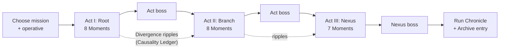

# 05: Run Structure

A **run** is a **mission**: a journey through three eras that ends at a Nexus Point. This document covers everything between fights: exploration, rewards, time travel within a run, Paradox, events, and how your choices ripple forward.

---

## Missions and Acts

| Act | Role | Steps before boss | Ends with |
|---|---|---|---|
| **I: Root** | Where the cause lies | 8 | Act boss |
| **II: Branch** | Where the consequence grows | 8 | Act boss |
| **III: Nexus** | The decisive moment | 7 | **Nexus boss** (an opposing faction's champion) |

- **Length.** A full mission takes about 40–45 minutes: roughly 11 fights at 2–3 minutes each, about 12 non-combat steps, and 3 boss fights.
- **Quick Mission.** One act of 6 steps plus the Nexus boss, about 15 minutes. It suits short mobile sessions.
- **Suspend anywhere.** The game saves an action log after every input, so a run resumes exactly where you left it, even mid-combat ([09](09-tech-architecture.md#determinism-and-saves)).
- **Starting state:**
  - your operative's starter deck and HP
  - **100 Hours** (the currency)
  - **2 Foresight** (3 for the Oracle)
  - **Paradox 0**
  - Standing **+1** with your faction and **0** with the others



---

## The Weft

This is DC's "pick 1 of 3 event cards", deepened. In weaving, the weft is the thread drawn across the loom, and each pass of it is called a *pick*. Here each step is one pick: you are dealt **3 Moments** from the act's **Era Deck** and choose one.

### Era Deck composition

Example for an 8-step act (24 cards):

| Moment | Count | What it is |
|---|---|---|
| Combat | 10 | A normal fight: era natives, faction squads or the Tear |
| Elite | 2 | A hard fight with better rewards (guaranteed Artifact) |
| Event | 5 | A narrative choice, including at least **1 Divergence** |
| Anomaly | 1 | Time weirdness ([below](#services)) |
| Antiquarian | 2 | The shop |
| Still Point | 2 | Rest |
| Shrine | 1 | A faction altar (yours or another's) |
| Cache | 1 | A free reward |

### Dealing rules

- The step before each boss **always** includes a Still Point.
- At least one Antiquarian appears between steps 3 and 6.
- The act's Divergence event appears between steps 4 and 7. In Act III it appears between steps 3 and 5.
- An act holds at most 2 Elites, not counting Returning Moments.
- When Paradox is Frayed or worse, **Tear Moments** are shuffled in ([Paradox](#paradox)).
- Fights draw from **era natives, the Tear, and factions you don't belong to**. Your own faction's squads only hunt you when your Standing with them is negative, as an apostate.

### What a Moment card shows

- **Always visible:**
  - the type icon
  - an era-flavored title, for example *"Fog on Fleet Street"*
  - for combats, the faction sigil
  - threat pips (1–3)
  - a reward hint
- **Hidden until you spend Foresight:** the exact enemies, the event's identity, and any shop discounts.

### Foresight

Foresight is a charge-based resource. Spending 1 Foresight:

- reveals the full details of all 3 current Moments
- reveals one Moment from the next step, which is guaranteed to be dealt

**Sources:**

- starting charges
- Antiquarian (40 Hours)
- some Artifacts, Imprints and events

---

## Returning Moments

The branches you didn't take don't vanish. Unchosen Moments go to the act's **Branch Pool**.

- **When they return.** At each later step, each Moment in the pool has a **25% chance** to return. At most **one** Moment returns per step. A returning Moment replaces one of the 3 dealt cards and has a "Returning" frame.
- **How they change.** A Moment comes back altered, according to its type:

| Type | Returns as | Effect |
|---|---|---|
| Combat | **Ambush** | The enemies act before your first turn. +50% Hours reward. |
| Elite | **Empowered** | +25% HP, +1 Might. Choose between **2** Artifacts. |
| Event | **Consequence** | A designer-written follow-up, such as "the village you passed burned" or "the scribe remembers you". |
| Antiquarian | **Looted** | Half the stock at −30% price, or gone entirely (50/50) |
| Shrine | **Desecrated** | Another faction claimed it; its boon is swapped for that faction's |
| Still Point / Cache | n/a | Rest and treasure don't wait for you |

- **Which Moment returns** can be chosen by the Chronicler's **Select** pattern, so that the return makes narrative sense, for example the elite you fled from tracking you down. When GenAI is off, and in Fixed Points runs, a seeded weighted random choice decides ([07](07-genai-design.md#returning-moments-select)).

---

## Anchors and Rewind

This is time travel inside a run, the signature mechanic of the map layer.

### Anchors

- Each act gives you **1 Anchor**, which is automatically set to a snapshot at the start of the act.
- You may *move* your Anchor to the current moment:
  - at a **Still Point**, with the Steady option, which also reduces Paradox
  - at any **Shrine**, for free, alongside its boon

### Rewind

You can Rewind at any time **outside combat**, or at the moment of **death**.

| | What happens |
|---|---|
| **Restored** | Your state at the Anchor: HP, deck, Hours, Artifacts, Imprints, Standing, Causality Ledger, Era Deck position |
| **Not restored** | **Paradox +3** (+5 if you are rewinding from death). Anything you revealed with Foresight stays revealed. |
| **The cost you meet later** | Your abandoned self becomes an **Echo**, with the deck it had at the moment you rewound. It is shuffled into a later act's Era Deck as an Elite Moment. Defeat it to reclaim **Lost Weight**: choose a card from its deck or an Artifact. |

- **The Anchor is spent** after a Rewind, and unused Anchors don't carry over between acts.
- **Determinism makes Rewind honest.** Runs are seeded, so after a Rewind the same Moments are dealt and the same draws happen, until you *choose differently*. You literally remember the future, which is time-travel fantasy without save-scumming randomness.
- **Entropy** difficulty levels can restrict Anchors ([06](06-meta-progression.md#entropy)).

---

## Paradox

Paradox is a **run-wide meter from 0 to 10** that represents strain on causality. Every operative deals with it. Errata operatives *use* it.

### Sources

| Source | Paradox |
|---|---|
| Rewind (normal / from death) | +3 / +5 |
| Errata cards | +1 to +3 each |
| **Glimpse** (seeing the alternate card reward) | +1 |
| Defection | +2 |
| Anomaly Moments | +1 or +2 |
| Some event choices | ±1 to ±2 |

### Reducing it

- −2 when you take the Steady option at a Still Point
- −1 at the start of each act
- some cards and events

### Thresholds

| Paradox | State | Effect |
|---|---|---|
| 0–3 | **Stable** | n/a |
| 4–6 | **Frayed** | Tear Moments join the Era Deck (+2 per act). Errata cards with "Paradox ≥ 4" conditions light up. |
| 7–9 | **Unstable** | All of the above, plus Elites gain +1 Might, and one Moment per step is an Anomaly |
| 10 | **Unravel** | Resolves immediately, then Paradox resets to 5 (see below) |

### Unravel

At 10 Paradox the Weave tears open around you.

- **In combat:**
  - every card in your Present becomes a random **Misprint** for the rest of the combat (from the [Misprint tables](08-card-dsl.md#misprint-tables))
  - a **Loose End** crawls through the Tear and joins the enemies
- **Outside combat:**
  - two random cards in your deck gain a permanent Misprint face
  - the next step is a **Tear ambush**
- **Errata:** the Splinter's *Unstable Equilibrium* Imprint moves Unravel to 12. Errata cards spend Paradox as fuel.

> **Design intent:** Paradox is the run's push-your-luck dial. Rewinding, Glimpsing and Defecting are all *good* moves with a real price. Errata players live at 6–9 on purpose.

---

## Rewards

### After combat

| Fight | Hours | XP | Card reward | Artifact |
|---|---|---|---|---|
| Combat | 15–25 | 10 | Choose 1 of 3 (or skip) | 5% |
| Elite | 40–55 | 25 | Choose 1 of 3, better odds | **Guaranteed** (choose 1 of 2 if Empowered) |
| Boss | 90 | 50 | Choose 1 of 3 **rares** (15% chance per card to upgrade to legendary) | Choose 1 of 3 **boss Artifacts** |

### Card pools

- **Mix:** 60% your faction, 20% neutral, 20% the current era.
- **After Defection:** 45% primary faction, 25% secondary faction, 15% neutral, 15% era.

### Rarity odds (normal combat)

| Rarity | Odds |
|---|---|
| Common | 60% |
| Uncommon | 32% |
| Rare | 8%, plus 2% for every reward without a rare (resets when one appears) |

Elites use 40% / 45% / 15%.

### Options on every card reward screen

- **Glimpse** (+1 Paradox). See the "other branch's" 3 cards as well, and choose from all 6.
- **Fork a card.** Instead of taking a new card, Fork one you own into a permanent **Branch Variant**, a second face created by the Forge ([08](08-card-dsl.md#the-forge), [07](07-genai-design.md#forge-branch-variants)).
  - Each card can be Forked once.
  - At most **3 Forks per run**.
- **Skip.** Take +10 Hours instead.

### Other upgrades

- **Inscribe** (upgrade) a card at a Still Point or Antiquarian. Inscribed versions are about 30% stronger.
- **Erase from history** (card removal) at the Antiquarian.

---

## Imprints

Imprints are DC's talents, kept and sharpened. XP comes from fights. Each level-up grants **+3 max HP** and a choice of **1 of 3 Imprints**. Some Imprints have **deck requirements**, so builds stay intentional.

| Level | 2 | 3 | 4 | 5 | 6 | 7 | 8 |
|---|---|---|---|---|---|---|---|
| Total XP | 20 | 50 | 90 | 140 | 200 | 270 | 350 |

- **Offers.**
  - 2 slots come from your operative's pool and 1 from the universal pool.
  - After Defection, one operative slot may come from the secondary faction.
- **Universal Imprints:**

| Imprint | Effect |
|---|---|
| Thick Skin | +8 max HP |
| Quick Study | Card rewards offer 4 cards instead of 3 |
| Pathfinder | +1 Foresight per act |
| Anchorite | You may move your Anchor twice per act |
| Long Credit | Borrow limit 3 |
| Paradox Sink | At each act start, −2 Paradox (instead of −1) |

Operative Imprint examples are in [03](03-factions-and-operatives.md).

---

## Artifacts

Artifacts are **out-of-place artifacts**: objects found in the wrong century. They are passives that last for the run.

**Sources:**

- Elites (guaranteed)
- bosses (choice of 3)
- Caches
- the Antiquarian (120–220 Hours)
- some events

| Artifact | Effect |
|---|---|
| **Antikythera Gear** | Start of each combat: Foresee 3. |
| **Baghdad Cell** | Your Reservoir cap is 8. |
| **Voynich Folio** | At the start of each act, a random card in your deck gains a permanent Misprint face. |
| **Library Ember** | When you reshuffle, keep 3 cards of your choice in the Past. |
| **Clockwork Sparrow** | The first time each combat you Delay an enemy intent, it gains no Pressure. |
| **Piri Reis Fragment** | +1 Foresight per act. Foresight reveals a second Moment of the next step. |
| **Gnomon Splinter** | Fixed intents deal 20% less damage to you. |
| **Lovelace's Notes** | Start of each combat: install a random Subroutine from your deck for free. |
| **Leonardo's Bearing** | You may use your Signature Action twice per turn. The second use costs 1 generic. |
| **Saltglass Hourglass** | Once per combat: restore the HP you lost during the last enemy phase. |
| **Misprinted Psalter** | Start each combat with +1 Paradox. Your Attacks deal +1 damage per 3 Paradox. |
| **Bell of the Still Hour** | At Still Points you may both heal *and* Inscribe. |
| **Byzantine Fire Jar** | Start of combat: apply Burn 3 to all enemies. |
| **Nebra Disc** | Your Scheduled effects get +1 to their numbers. |

### Boss Artifacts

Boss Artifacts are strong, and each one has a drawback.

| Artifact | Effect |
|---|---|
| **Aurelian's Seal** | +1 Faith income. You can't Borrow. |
| **MERIDIAN Shard** | Your Foresee effects +1. Predictive enemies gain +1 Might. |
| **The Thousandfold's Ribbon** | Your Other Hand holds +1 card (no Other Hand? you gain one with 2 cards). +1 Paradox at the start of each combat. |

---

## Services

### Antiquarian (shop)

| Service | Price (Hours) |
|---|---|
| Common / uncommon / rare card | 45 / 70 / 140 |
| Artifact | 120–220 |
| **Erase from history** (remove a card) | 75, then +25 each time |
| **Inscribe** a card | 60 |
| Foresight charge | 40 |

### Still Point (rest)

Choose one:

- **Heal** 30% of max HP
- **Inscribe** a card
- **Steady**: −2 Paradox, and move your Anchor here

### Cache

A free reward: an Artifact (40%), 60 Hours (40%), or a rare card (20%).

### Anomaly

Short, strange, time-bending events:

- **Meet Yourself.** An Echo of you from a future branch offers to swap one card with its deck.
- **The Loop.** Relive your last combat for double rewards. Paradox +1.
- **Rift.** Step into the Margins: an Errata encounter whose reward includes a free Fork (it doesn't count toward the 3-per-run limit).
- **Fading Street.** A neighborhood is thinning out of existence. Help it (lose 8 HP, +1 Errata Standing) or let it Fade (+40 Hours, +1 Paradox).

---

## Shrines and Defection

Every faction keeps altars across history.

| Shrine | Boon when it's **your** faction (choose 1) |
|---|---|
| **Order Chapel** | Erase a card from history · gain a Relic card · heal 20% |
| **Convergence Terminal** | Inscribe 2 cards · +2 Foresight · transform a card into a random card of the same rarity |
| **Errata Seam** | Fork a card (counts toward the 3-per-run limit) · gain 2 Paradox and a rare Errata card · swap a card for a random card from another faction |

At **another faction's** shrine you may:

- **Desecrate** it: +50 Hours, +1 Paradox, and −1 Standing with that faction.
- **Defect**, once per run:
  1. Your income's **Neutral becomes the new faction's color**, so you earn 2 primary + 1 secondary. You now pay their colored pips natively.
  2. Their cards enter your reward pools, and you gain one of their starter cards.
  3. Both factions' shrines now count as yours.
  4. Standing: **−2** with your original faction, **+1** with the new one. Paradox **+2**.
  5. The Ledger records `defected:<faction>`. Events notice, and so does the Still Hour.

> Defection is how DC's multi-color classes become a **story decision** in the middle of a run instead of a menu choice. Defecting with each operative also unlocks the hybrid operatives ([06](06-meta-progression.md#unlocks)).

---

## Standing

Each faction has a **Standing** with you, from −3 (hostile) to +3 (allied). It is changed by event choices, Desecration and Defection.

| Standing | Effect |
|---|---|
| ≤ −2 | Their squads appear more often (+1 combat per act), and their Returning combats always Ambush. |
| ≥ +2 | Their shrines offer an extra boon option, and their Antiquarians give a 20% discount. |
| End of Act III | Decides the **Nexus champion** you face ([03](03-factions-and-operatives.md#bosses)). The champion comes from a faction you don't belong to. If you never Defected, two factions qualify, and you face the one where your Standing is lowest. |

---

## Events

### How events are built

- **Designers write every event as a template**: the setup facts, the choices, and each choice's **mechanical outcome**.
- **The Chronicler writes the scene text.** It is a GenAI feature: an LLM writes the scene for the current era, the player's faction and the Causality Ledger ([07](07-genai-design.md#chronicler-event-narration)).
- If GenAI is off or slow, the template's **authored text** is used.

> **Trust rule:** a choice's outcome is always shown as **icons and numbers rendered by the engine**, such as Hours, cards, Paradox and Standing. The prose may *dramatize* a choice but may never hide or misstate it.

### Event types

| Type | Purpose |
|---|---|
| **Encounter** | Meet an era figure or a faction agent |
| **Dilemma** | A faction-conflict moral choice |
| **Divergence** | Change history. Creates a **Ripple** (below) |
| **Anomaly** | Time weirdness ([above](#services)) |
| **Consequence** | The follow-up when an Event returns from the Branch Pool |
| **Echo** | Meet a past self, from a Rewind or the Archive |

### Template example

```yaml
id: london.the_scribe
eras: [london_1843, milan_1495]
type: dilemma
tags: [scholar, forbidden_knowledge]
setup_facts:
  - "A scribe is secretly copying a page the Order has forbidden."
  - "An Order patrol is two streets away."
choices:
  - id: hide
    hint: "Hide the scribe"
    outcome: { standing: { order: -1, errata: +1 }, card_reward: errata_common, ledger: [scribe_hidden] }
  - id: report
    hint: "Hand the page to the Order"
    outcome: { standing: { order: +1 }, hours: 40, ledger: [scribe_reported] }
  - id: read
    hint: "Read the page yourself"
    outcome: { paradox: +2, foresight: +1, ledger: [read_forbidden_page] }
authored_text:            # the fallback, and the style reference
  title: "The Copyist"
  scene: "Candle stubs, ink on her cuffs, and the sound of boots on wet cobbles..."
  choices: { hide: "Pull her into the cellar.", report: "Take the page. The Line will judge it.", read: "Read it first." }
```

### Divergence events and Ripples

In a Divergence you **change history**.

- Each choice has a designer-defined set of **2–4 legal Ripples**: mechanical modifiers for the rest of the run, each with a short theme.
- The Chronicler **selects** the Ripple that best fits the story so far, and writes a short **Divergence Report**: the alternate history you just created.
- With GenAI off, or in Fixed Points runs, a seeded random choice picks the Ripple.
- Either way, **the Ripple's effect is shown before you confirm.**

**Example: *The Notes* (Act I, London 1843).**

| Choice | Ledger flag | Legal Ripples (one is selected) |
|---|---|---|
| Burn the notes | `london.notes_burned` | **The Engine Never Built**: Convergence enemies −10% HP this run · **The Order Takes Credit**: Order squads gain +1 Plate · **Ash in the Margins**: your next Anomaly is a Rift |
| Copy them for the Order | `london.notes_to_order` | **Canon of Engines**: Relic cards −25% at Antiquarians · **Holy Calculation**: Order enemies are Predictive in Act II · **Scriptorium**: Inscribe costs −20 Hours |
| Give them to the stranger from 2049 | `london.notes_to_stranger` | **Bootstrapped**: Convergence cards appear twice as often in rewards, but Proxies gain +1 Might · **Signal Loop**: +1 Foresight per act, +1 Paradox · **A Debt Owed**: MERIDIAN Ascendant cannot be your Nexus champion this run |
| Let history run | `london.notes_untouched` | **As Written**: Order Standing +1 · **The Tear Notices**: +1 Paradox, and the next Cache is upgraded |

**Divergence Report example:**

> *"In this branch the notes went into the fire on a Tuesday. Babbage's engine stayed a beautiful drawing. Fifty years later, the first calculating machines in London are built by monks, and they pray before they compute."*

---

## Causality Ledger

The **Causality Ledger** is the structured memory of a run. It is deterministic data, not prose.

```yaml
ledger:
  flags: [london.notes_burned, milan.heart_order_relic, scribe_hidden]
  counters: { combats_won: 7, rewinds: 1, paradox_peak: 6, forks: 2 }
  npcs: { ada_lovelace: met, leonardo: trusted, brother_aurel: spared }
  standing: { order: 2, convergence: -2, errata: 0 }
  divergences:
    - { event: london.the_notes, choice: burn, ripple: engine_never_built }
  defection: null
  echoes: [ { id: echo_a1_r1, act: 1, deck_hash: "9f3c…" } ]
```

### What reads it

- **Content filters:** events with prerequisites, such as *"if `scribe_hidden`: the scribe returns in Milan, a century earlier, and doesn't know why she recognizes you"*.
- **Returning Moments:** which Consequence variants are used.
- **Boss modifiers:** for example, the Automa Cavaliere's heart.
- **Nexus champion selection.**
- **The Chronicler:** for callbacks, it takes the top 3 relevant flags as context ([07](07-genai-design.md#context-packets)).
- **The Archive record and the Run Chronicle** at the end of the run.

---

## Bosses

- **Act bosses** are tied to their era (Act I: the Lattice Engine; Act II: the Automa Cavaliere).
- The **Nexus boss** is the champion of a faction you don't belong to. If two qualify, it's the one where your Standing is lowest ([Standing](#standing)).
- **Boss rewards:**
  - choose 1 of 3 boss Artifacts
  - choose 1 of 3 rare cards
  - a full heal before the next act

The rosters and mechanics are in [03](03-factions-and-operatives.md#bosses).

---

## Run Walkthrough

This is a Vowknight run on *The First Hour*, condensed into beats.

**Act I: London, 1843**

1. **Step 1.** The Moments are a Combat (Gaslight Footpads), an Event (*"The Copyist"*) and an Antiquarian. You take the fight for XP. The skipped Event goes to the Branch Pool.
2. **Step 3.** You spend 1 Foresight and see that the Elite is a **Pruner**, which would Erase your Future card by card. You choose the Still Point instead.
3. **Step 4.** *"The Copyist"* **returns** as a Consequence: the scribe is now in a cell. You free her: Order −1, Errata +1, and the flag `scribe_hidden`.
4. **Step 6, the Divergence *The Notes*.** You burn them. The Chronicler selects *The Engine Never Built* and writes a three-sentence alternate history.
5. **Boss: the Lattice Engine.** With Convergence enemies at −10% HP, it falls on turn 6. You take **Gnomon Splinter**.

**Act II: Milan, 1495**

6. **Step 2.** An Errata Seam. The scribe's friends vouch for you, and you **Defect**:
   - your income becomes 2 Faith + 1 Flux
   - Paradox goes to 2
   - Standing: Order −2, Errata +2
   - you also move your Anchor here
7. **Step 5.** A brutal Condottiero ambush leaves you at 12 HP. You **Rewind** to your Anchor at the Seam:
   - Paradox goes to 5 (Frayed), and an **Echo of you** enters Act III's Era Deck
   - the same Moments are dealt again, and this time you choose differently
8. **The Divergence *The Automaton's Heart*.** You install an Order relic, so the Automa Cavaliere fights with a Vow. You know the pattern it forbids, and you exploit it.

**Act III: The Salt Waste, 1191**

9. **Step 3.** You meet your **Echo**, holding the Act II deck you abandoned. You defeat it and reclaim *Crusader's Charge*.
10. **Step 5.** In *The Shadow of the Gnomon*, you let young Brother Aurel touch the relic. Even as a defector, you keep the Order's origin intact. The Order's Standing rises to −1.
11. **The Nexus.** You belong to the Order and the Errata, so the only faction left is the Convergence. **MERIDIAN Ascendant** comes for the Gnomon. You win.
12. **After the run.**
    - The Chronoscape marks *The First Hour* for the Order.
    - The **Run Chronicle** is written as an illuminated manuscript entry.
    - The run is filed in the Archive as *Branch 0x3F*. Its Echo may hunt a future run.
