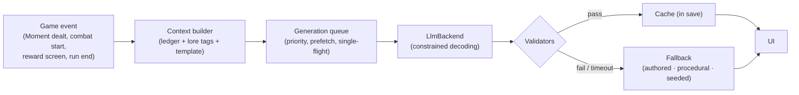

# 07: Generative AI Design

The game's generative AI is called **the Chronicler**. It is a small language model that runs **entirely on the phone** and writes the parts of the game that should be *about you*:

- the scene in front of you, aware of what you did three centuries ago
- the epitaph of your run, in your faction's voice
- the name and flavor of a card as it would exist in another branch of history

It never makes the rules. The runtime and models are covered in [09](09-tech-architecture.md).

> **Scope (confirmed):** *story plus checked mechanics.*
>
> - The LLM **narrates**.
> - It **selects** among outcomes that designers already made legal.
> - It **composes** card-variant *plans* that the engine validates against a power budget.
> - Free-text play is out of scope (see [Future Experiments](#future-experiments)).

---

## Principles

1. **The LLM proposes, the engine disposes.** Model output never changes game state directly. Every output is structured, validated and clamped by deterministic code.
2. **Nothing waits on the model.** Generation is prefetched in natural pauses. Every feature has an authored or procedural **fallback** that is always ready, and generation never sits on the combat critical path.
3. **Mechanics are never hidden in prose.** Outcomes, costs and rules text are rendered by the engine as icons and templates. The text may dramatize a choice but can never misstate it.
4. **Grounded and small.** Every request is built from a compact **context packet** of structured facts, of at most about 600 tokens. Small models do well with small, precise prompts.
5. **Deterministic where it matters.** Seeded fallbacks, caches and challenge-mode rules keep fairness and replays intact.
6. **Offline, private and optional.** No network is required and no data leaves the device. Players choose **Off / Lite / Full**.
7. **Transparent and reportable.** Generated text carries a small quill mark and can be reported in-app.
8. **Words only at runtime.** The on-device model never generates images or rules. People write the rules, the core story and the style guides. The art is made at development time with AI assistance and finished by people ([12](12-art-pipeline.md)).

---

## Where GenAI Helps, and Where It Doesn't

| Use | Why GenAI improves the game | Why not just authored or procedural content |
|---|---|---|
| **Event narration** | Events stay fresh after 100 runs and reference *your* history across eras. This is the time-travel fantasy of consequences. | Authored text repeats. Templated callbacks read as mad-libs. |
| **Run Chronicles** | Every run gets a unique, shareable epitaph in a faction voice. | Generic end-of-run stat screens are forgettable. |
| **Branch Variants** (names, flavor, mutation choice) | Your cards become *yours*, and alternate history becomes a mechanic. | Procedural names are flat. Random mutations lack theme. (The procedural version is still the fallback.) |
| **Selecting Ripples and Returning Moments** | Picks the legal outcome that best fits the story so far. | Random selection can contradict the narrative. |
| **Enemy lines and Echo voices** | Bosses and past selves react to *your* deck and choices. | Fixed bark pools wear out fast. |

| Not planned | Reason |
|---|---|
| Runtime image generation | On-device image models are slow and inconsistent, and every image needs a human finishing pass. Art is made at development time instead ([12](12-art-pipeline.md)), and variant cards get **shader** treatments: double exposure, misprint offsets. |
| LLM-written rules or numbers | Balance and fairness must be deterministic. The DSL and budget own mechanics ([08](08-card-dsl.md)). |
| Adaptive difficulty "by LLM" | A deterministic director is cheaper, testable and fair. |
| Story-critical plot | Authored. GenAI adds color *around* beats ([06](06-meta-progression.md#meta-story-delivery)). |

---

## The Four Patterns

| Pattern | Input | Output | Constraint | If it fails |
|---|---|---|---|---|
| **Narrate** | Context packet + style tags | Text in a JSON wrapper (title, scene, choice lines) | JSON schema, length limits, filters | Authored text |
| **Select** | Context packet + list of legal option IDs with descriptions | One option ID (plus a short rationale for logs) | Enum-constrained decoding: it *cannot* pick an illegal option | Seeded weighted random |
| **Compose** | Card data + allowed ops + budget target | A **VariantPlan** ([08](08-card-dsl.md#variantplan-schema)) | JSON schema with op enums; engine validation and auto-tune | Procedural plan |
| **Judge** | Player free text | A bounded score | n/a | **Out of scope** |



---

## Feature Specs

Each spec lists its trigger, context, output, budget, fallback and caching. Token budgets are *output* tokens. Context packet sizes are in [Context Packets](#context-packets).

### P0: ships with the first GenAI release

#### Chronicler: Event Narration

| | |
|---|---|
| **Trigger** | An Event, Anomaly, Divergence or Consequence Moment is **dealt**. This is a prefetch: the text is usually ready before you choose. |
| **Context** | Era, location, POV faction, operative, the event template's setup facts, choice IDs with hints and outcome summaries, the top 3 relevant ledger flags, Standing, and style tags |
| **Output** | `{ title (≤ 6 words), scene (≤ 110 words), choices: [{ id, text (≤ 12 words) }] }`. The choice IDs must match the template. |
| **Budget** | ≤ 220 tokens · target ready ≤ 6 s (Tier A, P90) |
| **Fallback** | The template's authored text |
| **Cache** | Saved in the run, keyed by (template, Moment, ledger hash), so a reload shows the same text |

**Example output** (Vowknight, London 1843, template `london.the_scribe`):

```json
{
  "title": "The Copyist of Fleet Street",
  "scene": "Candle stubs, ink on her cuffs, and a page she is not meant to have. The copyist does not stop writing when your shadow falls across her desk; she only writes faster, as if words could be saved by being doubled. Two streets away, boots on wet cobbles: an Order patrol, singing the hour. She looks at your tabard, then at your eyes, and decides something about you that you have not decided yet.",
  "choices": [
    { "id": "hide",   "text": "Pull her into the cellar and bar the door." },
    { "id": "report", "text": "Take the page. Let the Line judge it." },
    { "id": "read",   "text": "Read it first. Just once." }
  ]
}
```

The engine renders each choice's real outcome next to its line as icons, for example *Order −1 · Errata +1 · Errata card*.

#### Run Chronicle

| | |
|---|---|
| **Trigger** | The run ends, by win or loss. Generated while the stats screen animates, then streamed with a typewriter effect. |
| **Context** | Operative, factions (including Defection), mission and eras, up to 8 key ledger events, Divergences and their Ripples, cause of victory or defeat, 3 signature cards, Paradox peak, Rewinds |
| **Output** | `{ title, chronicle (≤ 220 words) }` in the **faction voice** ([02](02-world-and-lore.md#faction-voices)) |
| **Budget** | ≤ 320 tokens |
| **Fallback** | A template chronicle assembled from the ledger, with authored sentence frames per faction |
| **Cache** | Saved permanently in the Archive record |

**Voice samples** (excerpts):

> **Order.** *"Here is set down how Sister-Errant Maren of the Faded Ward kept the Line in the year of grace 1843, and in the years before it. She burned what ought to burn. She bent the knee at a heretic's altar and was not struck down, which the scribes record without comment. At the Salt Waste she let a young brother touch the shadow, as was written. The Canon holds. Pray for her."*

> **Convergence.** *"LOG ∞/0x3F. OPERATIVE: ORACLE. NEXUS 'THE FIRST HOUR': CONVERGED (p=0.71 → 1.00). Deviations: 2. Rewinds: 1 (cost accepted). Note: operative spared the copyist (utility −0.3; flagged for review; review declined by MERIDIAN). Appended by KESTREL: 'You looked at the window for a long time before you left. I understand that now.'"*

> **Errata.** *"(scrawled in the margin, three different hands) we were there. she rewound once & came back meaner ~~kinder~~. the notes went to the stranger, who was us, obviously. the Gnomon cracked like ice and a thousand of us walked out laughing. write this down somewhere they can't burn it ‸"*

#### Combat Barks

| | |
|---|---|
| **Trigger** | **Combat start.** One call produces lines for all trigger tags of that fight. |
| **Context** | Speaker persona sheet (boss, elite or Echo), trigger tags (`intro`, `phase_2`, `player_low_hp`, `big_hit`, `defeat`), deck statistics (for example "40% Attacks, 2 Vows"), one optional ledger callback |
| **Output** | `{ lines: { <tag>: string ≤ 18 words } }` |
| **Budget** | ≤ 150 tokens |
| **Fallback** | Authored bark pool per enemy |
| **Cache** | Per combat |

**Examples:**

- **Lattice Engine:** *"Your deck is forty percent Strikes. I have prepared for exactly that."*
- **Grand Master Aurelian:** *"I was young here once. Step aside, child of no branch."*
- **The Thousandfold:** *"Which of us are you aiming at? Wrong. Try again."*

### P1

#### Forge: Branch Variants

| | |
|---|---|
| **Trigger** | The player picks **Fork a card** on a reward screen, or at an Errata Seam. Generation runs while they look at the card list. |
| **Context** | Source card (DSL), faction, era, a theme hint from the ledger or a recent Divergence, the **allowed ops list** (computed by the engine), and the budget target |
| **Output** | A **VariantPlan** ([08](08-card-dsl.md#variantplan-schema)), constrained by JSON schema |
| **Budget** | ≤ 160 tokens |
| **Pipeline** | Apply ops → auto-tune → validate → show old face vs new face → **Keep / Reroll once / Pick another card**. One retry, with the validator error added to the context. |
| **Fallback** | A procedural plan (seeded legal ops, a name built from the era lexicon, flavor from an authored pool) |
| **Cache** | The plan is stored on the card, so the variant is permanent data |

#### Divergence Ripples

| | |
|---|---|
| **Trigger** | A Divergence choice is confirmed. The Select step is prefetched for every choice when the Moment is dealt. |
| **Pattern** | **Select** one of 2–4 legal Ripple IDs, then **Narrate** a Divergence Report (≤ 90 words). |
| **Budget** | ≤ 160 tokens |
| **Fallback** | Seeded weighted random Ripple plus an authored report |
| **Fairness** | In Fixed Points runs, always the fallback |

#### Returning Moments (Select)

| | |
|---|---|
| **Trigger** | The start of a step, if a Returning Moment rolled ([05](05-run-structure.md#returning-moments)) |
| **Pattern** | **Select** which Branch Pool Moment returns, plus a one-line consequence title |
| **Budget** | ≤ 20 tokens. This is a fast call, and it falls back after 1.5 s. |
| **Fallback** | Seeded weighted random choice |

#### Echo Rival Lines

| | |
|---|---|
| **Trigger** | An Echo Moment is dealt |
| **Context** | That branch's ledger summary, its operative and factions, and how it ended |
| **Output** | 3–5 lines for combat tags, for example *"I burned the notes. You hesitated."* |
| **Fallback** | Authored Echo lines with ledger-slot templates |

#### Hub Callbacks

| | |
|---|---|
| **Trigger** | Entering the Still Hour after a run |
| **Context** | The resident's persona sheet, the authored beat that just played (if any), and the last 1–3 Archive records |
| **Output** | One remark of at most 40 words, appended *after* the authored line |
| **Fallback** | No remark. The authored beats stand alone. |

### P2

#### Branch Codex Entries

| | |
|---|---|
| **Trigger** | In the background after a run that created Divergences |
| **Output** | A short encyclopedia entry (≤ 150 words): *"Branch 0x3F: where the notes burned"* |
| **Fallback** | An entry template listing the Divergence and its Ripple |

#### Archivist Explainer

| | |
|---|---|
| **Trigger** | On demand: "What just happened?" after an enemy phase, or "Describe the board" for TalkBack users |
| **Context** | The engine's **structured event log** for the last phase, or the board state. This is the source of truth; the model only verbalizes it. |
| **Output** | ≤ 80 words of plain-language explanation |
| **Fallback** | Templated log lines, which are always available |
| **Value** | Teaches interactions (Pressure, Fixed, Forked intents), and an accessibility win |

### Future Experiments

These are **not planned**. They are recorded so the idea isn't lost.

- **Parley.**
  - **The idea:** talk your way through an encounter by text or voice. The LLM role-plays the NPC, and a separate **Judge** call scores the argument against the NPC's values, producing a *bounded* outcome such as a discount, intel, or avoiding the fight.
  - **Why not now:** prompt-injection and exploit pressure, typing friction on mobile, harder fairness and rating, and on-device latency for multi-turn chat.
  - **If revived:** outcomes are limited to designer-defined ranges, there are no free-text effects on rules, and it is opt-in only.
- **Narrated chronicles** with on-device text-to-speech.
- **Multilingual narration.** Gemma models are multilingual, so localized narration could follow localized authored fallbacks ([10](10-roadmap.md#open-questions)).

---

## Context Packets

Each request has two parts:

- a **static prefix**: system rules, the task's instructions and schema, and the faction style guide. It is identical across calls, so its KV cache is reused.
- a **dynamic packet**: the facts for this one request.

```yaml
task: NARRATE_EVENT                    # NARRATE_EVENT | CHRONICLE | BARKS | VARIANT_PLAN | SELECT_RIPPLE | ...
story_stage: { movement: 2, fractures_done: [order], shuttle: false }   # gates lore and reveals
era: london_1843
location: "Fleet Street print shop, night"
pov: { faction: order, operative: vowknight, defected_to: null }
template:
  id: london.the_scribe
  setup_facts: ["A scribe is secretly copying a page the Order has forbidden.", "An Order patrol is two streets away."]
  choices:
    - { id: hide,   hint: "Hide the scribe",            outcome: "Order -1, Errata +1, gain an Errata card" }
    - { id: report, hint: "Hand the page to the Order", outcome: "Order +1, gain 40 Hours" }
    - { id: read,   hint: "Read the page yourself",     outcome: "Paradox +2, Foresight +1" }
callbacks: ["Act I: you spared a Brass Proxy that begged in a dead man's voice"]
lore: ["order.creed.short", "london_1843.mood"]     # tag-retrieved snippets from the Lore Bible
style: { voice: order, tone: mythic_bittersweet, max_words: 110 }
avoid: ["modern slang", "game terms", "numbers", "moralizing"]
```

- **Lore Bible.** Factions, eras, places, characters, glossary and voice guides are stored as **tagged, structured snippets**. The context builder selects 2–4 snippets by tag (era, faction, NPC). No vector database is needed, because the corpus is small and curated.
- **Spoiler gating.** Every snippet carries an `unlock` tag: for example `movement_2.order`, `movement_3` or `shuttle`. The context builder only selects snippets the player's `story_stage` has reached. The model can't leak what it was never shown, such as the Last Hour being the Tear, MERIDIAN's proof, or the ninth law.
- **Persona sheets** for every speaking character contain: voice, three facts, one secret, and words they never use.
- **Budgets:**

| Feature | Packet (input) | Output |
|---|---|---|
| Event narration | ≤ 600 | ≤ 220 |
| Run Chronicle | ≤ 700 | ≤ 320 |
| Barks | ≤ 400 | ≤ 150 |
| Forge | ≤ 600 | ≤ 160 |
| Divergence (select + report) | ≤ 600 | ≤ 160 |
| Returning Moment select | ≤ 300 | ≤ 20 |
| Echo lines | ≤ 400 | ≤ 80 |
| Hub callback | ≤ 400 | ≤ 60 |
| Branch Codex entry | ≤ 500 | ≤ 220 |
| Archivist explainer | ≤ 600 | ≤ 120 |

**Typical output per full run: about 5,000 tokens** in Full mode. That is roughly 2 minutes of generation on a Tier A phone, spread over a 45-minute run in natural pauses. Tier B runs Lite mode, which generates about half as much on a slower model ([09](09-tech-architecture.md#device-tiers)).

---

## Validation Layers

Every output passes through these layers in order. Any failure means one retry, where the task allows it, and then the fallback.

1. **Schema.** Guaranteed by constrained decoding (JSON Schema / enums), and re-checked.
2. **Semantic checks:**
   - choice IDs match the template
   - lengths are within limits
   - no digits in event scenes or choice lines, because numbers belong to the engine (Run Chronicles are exempt; the Convergence voice loves a statistic)
   - nothing contradicts the outcome icons: a "gain" outcome can't be narrated as a loss (simple polarity check)
3. **Lore lint:**
   - blocks out-of-world terms ("AI model", "as a language model", modern brands)
   - blocks the names of living people, using a curated list (a legal limit; historical figures of any era are fine)
   - flags wrong-era anachronisms unless the speaker is a traveller
   - keeps the faction's name list consistent
   - **spoiler guard:** blocks reveal phrases for twists the player hasn't unlocked yet (a curated list per arc, for example "no right thread" before Movement III)
4. **Safety filter:** an on-device blocklist plus a small toxicity classifier for what store policy prohibits: slurs and hate speech aimed at real groups, sexual content, and self-harm instructions. History itself (wars, faiths, politics, atrocities) is subject matter, not a filter category.
5. **Repetition guard:** n-gram overlap against the last 20 outputs of the same template.
6. **Fallback.** Authored, procedural or seeded. It is always available and always valid.

---

## Scheduling and Performance

- **Generation queue.** One generation runs at a time (single-flight), with three priorities:
  1. *needed now*
  2. *prefetch for the current step*
  3. *background* (Codex, chronicles)
- **Prefetch points:**
  - Moments dealt → narration for Events, plus the Divergence select
  - combat start → barks
  - reward screen opens → a Forge plan, but only if the Fork option is visible and affordable
- **Cancellation.** Stale prefetches are cancelled, for example the narration for a Moment the player didn't pick.
- **The 1.5-second rule.** If the text is needed and isn't ready, show the quill animation for up to 1.5 s, then the fallback. Text is **never swapped** after it has been shown.
- **During combat:**
  - only the barks call (at combat start) and background jobs may run
  - inference runs at lower priority and prefers the NPU or CPU, to keep the GPU free for 60 fps animation
  - on Tier B, background jobs pause during combat
- **Device guard.** When thermal headroom is low or battery saver is on, the game steps down from Full to Lite to Off automatically and tells the player once.

---

## Determinism and Fairness

- **Generated text lives in the save,** so reloading a run never changes what you read.
- **Separate random streams.** Game RNG streams never depend on model output. Model outputs that affect mechanics are limited to **Select** and **Compose**, and both:
  - are recorded in the action log, so replays don't re-run the model
  - are bounded to legal, budgeted options
- **Fixed Points** challenge runs use the seeded fallbacks for Select and Compose, so every player gets identical mechanics. Narration may differ, because it is flavor only.
- **Bug reports** carry the template ID, a packet hash, the model and adapter version, and the decoding settings. That is enough to reproduce the issue on a dev machine.

---

## Player Controls

**Settings → The Chronicler:**

| Mode | What runs | Default for |
|---|---|---|
| **Off** | Authored text, procedural variants and seeded selections. The game is 100% complete. | Tier C devices and players who opt out |
| **Lite** | Barks, short narration (≤ 60 words) and chronicles. The Forge uses procedural plans but generated names. | Tier B |
| **Full** | Everything | Tier A |

- **Per-feature toggles:** event narration, chronicles, combat lines, Forge, hub callbacks.
- **Quill marks** on generated text are on by default.
- **Report.** Long-press any generated text and choose Report. Categories: offensive, misstates rules, lore error, other.
  - The report is stored locally with the packet hash and model version.
  - It can be sent with the player's consent through the share sheet or a queued upload.
  - This in-app reporting is required by Google Play's AI-generated content policy.
- **Regenerate** is available once per text, for pure-flavor text only (events, chronicles, Codex). It is never offered for Select or Compose outcomes, so players can't reroll mechanics.

---

## Safety, Policy and Ethics

- **Google Play's AI-generated content policy** requires an in-app way to report or flag offensive generated content. The Report flow covers it.
- **Low exposure by design.**
  - The core game takes **no free-text player input**, so there is no prompt-injection surface.
  - Prompts are built only from game state and curated lore.
- **Content limits** follow the [content principles](02-world-and-lore.md#content-principles):
  - Any era, event or historical figure can appear.
  - *Present, don't preach* is part of every prompt's style rules: the Chronicler never judges the player or the past.
  - Every historical figure who speaks gets a persona sheet, for consistency.
  - No living people.
  - The rating follows the content.
- **Transparency.**
  - The store listing and first-run screen explain that a small on-device model writes some text, that it never sees personal data, and how to turn it off.
  - The rules and core story are written by people. The art is AI-assisted and finished by people, and the store page and credits say so ([12](12-art-pipeline.md#legal-and-disclosure-checklist)).
- **Training data provenance.**
  - Fine-tuning data comes from our own Lore Bible, authored exemplars, and teacher-model outputs generated from our own prompts ([09](09-tech-architecture.md#fine-tuning-pipeline)).
  - No scraped fiction is used.
- **Privacy.** Inference runs on-device and the game is offline. Analytics are opt-in and never include generated text unless a player sends a report.

---

## Evaluation

The evaluation suite runs in CI on desktop (JVM) and on reference phones for every model or adapter change. Release gates:

| Metric | Gate |
|---|---|
| Schema validity (constrained decoding) | ≥ 99.9% |
| Semantic validity (IDs, lengths, digits, polarity) | ≥ 99% |
| Forge: valid plan within 1 retry | ≥ 95% (the rest go procedural) |
| Overall fallback rate on Tier A | ≤ 5% |
| Faction voice: style classifier accuracy | ≥ 90% |
| Blind human rating (coherence, tone, callback quality, no moralizing; 1–5) | mean ≥ 4.0, no feature below 3.5 |
| Lore contradictions per 100 outputs (LLM-judge + human spot check) | ≤ 2 |
| Safety violations in 10k adversarial-context samples | 0 |
| Repetition: distinct-3-gram ratio over 100 narrations of one template | ≥ 0.6 |
| Event narration latency, P90, Tier A | ≤ 6 s |
