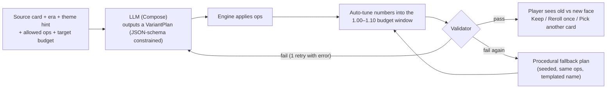

# 08: Card DSL and Power Budget

Every card in the game, whether hand-made or forged, is **data** in one small language. Three things read that data:

- **the rules engine**, which executes it
- **the content pipeline**, which validates and budgets it
- **the Forge**, the generative system that creates Branch Variants ([07](07-genai-design.md#forge-branch-variants))

There is one language, one validator and one budget for all three. This is what keeps generated cards fair: the LLM never writes rules, only *plans* that the engine turns into rules and checks.

> **Golden rule:** a card's rules text is always **rendered by the engine** from its effects through localized templates. Generated cards get a name and flavor from the LLM, never rules text.

---

## Card Schema

Cards are authored in YAML and compiled to a binary bundle at build time. Field reference:

```yaml
id: order.line_strike          # namespaced, stable forever (saves reference it)
name: Line Strike
faction: order                 # order | convergence | errata | neutral | era.<era_id>
type: attack                   # attack | skill | constant
subtype: null                  # constants only: vow | relic | subroutine
rarity: starter                # starter | common | uncommon | rare | legendary
cost: { generic: 1 }           # any of: faith, compute, flux, generic
keywords: [attuned]            # for display/search; effects carry the actual logic
effects:
  - op: damage
    target: chosen_enemy
    amount: 5
  - op: damage                 # the Attuned rider
    target: same_target
    amount: 2
    when: attuned
inscribed:                     # the upgraded version (Inscribe), budget x1.30
  effects:
    - { op: damage, target: chosen_enemy, amount: 7 }
    - { op: damage, target: same_target, amount: 2, when: attuned }
flavor: "The Line holds because each of us holds."
art: art/order/line_strike
tags: [starter, basic_attack]
```

### Constants add a trigger, and Vows add a restriction

```yaml
id: order.vow_of_the_sword
name: Vow of the Sword
faction: order
type: constant
subtype: vow
rarity: starter
cost: { faith: 1 }
trigger: while_kept            # start_of_turn | end_of_turn | on_play:<kind> | on_shift | on_delay | on_lose_hp | while_kept
effects:
  - { op: modify_signature, stat: damage, amount: 2 }
vow:
  restriction: { rule: max_cards_of_type_per_turn, type: skill, max: 1 }
  severity: moderate           # mild | moderate | severe  -> budget credit 4 / 8 / 12
exception: "Below budget on purpose: in simulation, +4 widened the Vowknight's lead"   # see Budget Targets
```

### Fork cards have faces; Misprint cards have a face table

```yaml
id: errata.two_places_at_once
type: attack                   # type of face A; face B may differ
cost: { generic: 1 }
faces:
  a: { type: attack, effects: [ { op: damage, target: chosen_enemy, amount: 5 } ] }
  b: { type: skill,  effects: [ { op: block, amount: 4 } ] }

id: errata.misprinted_edict
cost: { flux: 1, generic: 1 }
misprint:                      # one is rolled when drawn
  - { type: attack, effects: [ { op: damage, target: chosen_enemy, amount: 14 } ] }
  - { type: attack, effects: [ { op: damage, target: all_enemies, amount: 7 } ] }
  - { type: skill,  effects: [ { op: block, amount: 10 }, { op: draw, n: 1 } ] }
```

### Effect node grammar

| Field | Meaning |
|---|---|
| `op` | A primitive (see [the table below](#primitives-and-point-costs)) |
| `target` | `self`, `chosen_enemy`, `same_target`, `random_enemy`, `weakest_enemy`, `all_enemies`, `chosen_intent`, `chosen_track_item`, `card_in_present`, `card_in_past` |
| `amount` / `n` / `turns` / `stacks` | Magnitude |
| `repeat` | Number of hits (`damage` ×repeat) |
| `when` | A condition (below) |
| `schedule` | Countdown N; the effect goes on the Track |
| `scale` | `{ per: <counter>, amount: N, max: M }` for "+N per X" effects |
| `afterimage` | `true` to repeat at half value next Dawn |

### Conditions

Each condition has a **difficulty category**, which sets its budget multiplier.

| Condition | Example | Category |
|---|---|---|
| `attuned` | paid fully in faction color | special: ×0.5 |
| `remember: {kind, n}` | 3+ Attacks in your Past | any kind: n ≤ 4 easy, 5–8 medium · specific kind: n ≤ 3 medium, n ≥ 4 hard |
| `litany: {kind}` | previous card was a Skill | medium |
| `calculated` | this card is Known | medium |
| `vow_kept` | you have an unbroken Vow | medium |
| `paradox_at_least: n` | Paradox ≥ n | n ≤ 4 medium · n ≥ 7 hard |
| `enemy_faction: [..]` | target is Errata or Tear | hard |
| `hp_below_pct: n` | your HP below n% | n ≥ 50 easy · n < 50 medium |
| `constants_at_least: n` | n+ Constants in play | n = 1 easy · n ≥ 2 medium |
| `shifted_this_turn` | you Shifted at least once this turn | medium |
| `target_has: <status>` | target is Exposed | medium |

---

## Primitives and Point Costs

**The anchor:** 1 energy of cost ≈ **12 points**. That buys about 6 damage or 5 Block, the classic deckbuilder baseline.

| Primitive | Args | Points |
|---|---|---|
| `damage` (chosen enemy) | amount, repeat | **2** per damage |
| `damage` (weakest enemy) | amount | 1.9 per damage |
| `damage` (random enemy) | amount | 1.7 per damage |
| `damage` (all enemies) | amount | 3 per damage |
| `block` | amount | **2.4** per Block |
| `plate` | stacks | 5 per stack |
| `might` | stacks | 8 per stack |
| `draw` | n | **6** per card |
| `gain_energy` | color, n | **10** per energy |
| `cost_reduction` | n (chosen card, this turn) | 10 per energy |
| `foresee` | n | 2 per card |
| `tutor_from_foresee` | (put one Foreseen card into Present) | 8 |
| `recall` | n | 7 per card |
| `delay` | n | 10 for 1 · 18 for 2 |
| `accelerate` | n | 4 per point |
| `remove_intent` | (not Fixed) | 14 |
| `observe` | (collapse a Forked intent) | 4 |
| `apply_weak` | turns | 4 per turn |
| `apply_exposed` | turns | 5 per turn |
| `apply_burn` | stacks | 3 per stack |
| `apply_slow` | none | 6 |
| `restore_hp` | amount (expected) | 2 per HP |
| `shift` | n | 4 per swap |
| `fork` | (grant a Misprint face) | 6 |
| `bleed_through` | n | 8 per card |
| `retain` | none | +2 |
| `modify_signature` | stat, amount | as the underlying primitive |
| `gain_paradox` | n | **−2** per point (drawback) |
| `spend_paradox` | n | **−3** per point (a cost; the card can't be played without it) |
| `lose_hp` | n | **−2** per HP |
| `erase_self` | none | **−3** |

---

## Modifiers

| Modifier | Rule |
|---|---|
| **Condition** | Effect value × **0.8** (easy) / **0.6** (medium) / **0.4** (hard) |
| **Attuned rider** | Rider value × **0.5** |
| **Schedule N** | Effect value × **0.8^(N−1)**. Schedule 1 resolves at this Dusk's enemy phase, so it is undiscounted. |
| **Constant** | Per-trigger value × **2.4**. This assumes about 4 triggers, discounted for setup tempo and slot cost. |
| **Iterate +N** | Increment value × **1.5** (expected extra plays) |
| **Afterimage** | +50% of the repeated effect's value |
| **Fork card** (two faces) | max(face A, face B) **+ 2** |
| **Misprint card** | Mean of its faces; each face must be within ±25% of the target |
| **Scaling** (`scale`) | Costed at the **expected value** using the standard assumptions below |
| **Vow restriction** | Budget credit: −4 mild / −8 moderate / −12 severe (includes the Penance risk) |

### Standard expected-value assumptions

These are tuned from simulation and versioned with the content.

| Counter | Expected value |
|---|---|
| Cards in your Past (mid-combat) | 8 |
| Paradox | 3 |
| Known cards in Present (Oracle) | 1.8 |
| Shifts per turn (Splinter) | 1.5 |
| HP lost in the last enemy phase | 8 |
| Constants in play | 1 |
| Constant triggers | 4 (the ×2.4 factor already includes a 0.6 discount) |

---

## Budget Targets

| Total cost (pips) | 0 | 1 | 2 | 3 | 4 |
|---|---|---|---|---|---|
| **Base budget** | 6 | 12 | 24 | 36 | 48 |

| Rarity | Multiplier |
|---|---|
| Starter / Common | ×1.00 |
| Uncommon | ×1.10 |
| Rare | ×1.25 |
| Legendary | ×1.40 |

| Card class | Allowed range |
|---|---|
| Authored cards | **±10%** of target. Exceeding it needs an `exception:` note with a reason, reviewed in playtests. |
| **Inscribed** (upgraded) versions | ×1.30 of target, ±10% |
| **Forge variants** | **1.00–1.10** × target. This is a small reward bump, because forging replaces taking a new card. |

> The budget is a **sanity rail**, not a balance oracle. Rares and legendaries exist to break patterns, which the budget can't fully price. Simulation ([09](09-tech-architecture.md#testing-and-qa)) is the final judge, and its results feed back into the cost table.

### Worked budget: Remembered Blow

The card is `1F+1`, common, so its target is 24.

| Part | Points |
|---|---|
| Deal 9 | 9 × 2 = 18 |
| Remember 3 Attacks: +5 damage (medium) | 5 × 2 × 0.6 = 6 |
| **Total** | **24 / 24** ✓ |

---

## Validator Rules

The same validator runs in four places: content CI, the Forge pipeline on device, the dev-time fine-tuning data filter, and debug builds at load time.

1. **Schema-valid:** known ops, targets and conditions, and legal field types.
2. **Budget** within the allowed range for its class (above).
3. **Complexity caps:**
   - at most 3 effects per face
   - at most 1 condition per effect
   - at most 2 keywords per face, not counting Attuned
   - rendered rules text of at most 140 characters (English)
4. **Rarity-gated primitives:**
   - `gain_energy` ≥ 2, `remove_intent` and `tutor_from_foresee` are rare or higher
   - `delay` 2 and `recall` ≥ 2 are uncommon or higher
   - a 0-cost card may draw at most 1
5. **Faction legality:** a card uses only universal keywords plus its own faction family. Neutral and era cards use universal keywords only.
6. **Loop guard:**
   - A 0-cost card may never return itself to the Present.
   - `on_play` triggers may not play cards.
   - The engine also hard-caps plays at 60 cards per turn.
7. **Number ranges:**
   - damage per hit ≤ 40
   - Block ≤ 40
   - draw ≤ 4
   - Foresee ≤ 6
   - Delay ≤ 2
   - Paradox gain ≤ 3
8. **Names:**
   - at most 24 characters
   - unique within the player's collection
   - pass the lore lint and the safety filter ([07](07-genai-design.md#validation-layers))
9. **Flavor:**
   - at most 120 characters
   - no digits, so it can't masquerade as rules
   - passes the same filters

---

## The Forge

**Forking** a card you own (a reward option in [05](05-run-structure.md#rewards)) gives it a permanent **Branch Variant**: a second face, as that card would exist in another branch of history. The generative part only picks *how* to mutate the card and what to call it. Everything else is deterministic.



### VariantPlan schema

```json
{
  "theme":  "string, at most 60 chars: what is different in this branch",
  "ops":    [ { "op": "<mutation op>", "...": "op-specific args" } ],
  "name":   "string, at most 24 chars",
  "flavor": "string, at most 120 chars, no digits"
}
```

`ops` holds 1–3 entries, drawn only from the **allowed ops list** that the engine computes for this card and passes in the prompt. The JSON schema enforces the enum, so the model physically cannot emit an unknown op.

### Mutation ops

| Op | Args | What it does |
|---|---|---|
| `trade` | from, to | Converts value between primitives at budget rates, e.g. Block → Plate or damage → Burn |
| `retarget` | effect, target | Changes the target and rescales the amount by the cost ratio, e.g. single → all enemies |
| `split` | effect, parts | Splits one effect into multiple hits or parts |
| `add_condition` | effect, condition | Makes an effect conditional; auto-tune boosts its magnitude |
| `add_drawback` | drawback | Adds `gain_paradox`, `lose_hp` or `erase_self`, and frees budget for boosts |
| `schedule` | effect, n | Moves an effect onto the Track; frees budget (time flavor) |
| `add_afterimage` | effect | Makes the effect echo next Dawn, at reduced magnitude |
| `swap_keyword` | from, to | Replaces a keyword-driven rider with another legal one (same faction family or universal) |
| `cost_shift` | delta (±1) | Changes total cost and rescales everything |
| (implicit) | name, flavor | Always applied |

### Auto-tune

1. After applying the ops, compute the budget.
2. Scale the numeric magnitudes, largest effect first, to land in the 1.00–1.10 × target window, rounding to integers.
3. If rounding can't reach the window, add or remove **one** small rider from a whitelist: Retain (+2), Foresee 1 (+2), or Block 1 (+2.4).
4. If the result is still outside the window, it is invalid: retry once, then fall back to the procedural plan.

### Worked examples

#### 1. Line Strike → Legion's Cadence (Order)

**Theme:** *"In this branch, Rome never fell."*
**Ops:** `split(damage, 2)` + `swap_keyword(attuned → litany:skill)`.

| | Effects | Points | vs target (12) |
|---|---|---|---|
| Source | Deal 5. Attuned: +2. | 10 + 2 = 12 | 1.00 |
| After ops, before tune | Deal 3 twice. Litany (Skill): +2 per hit. | 12 + 4.8 = 16.8 | 1.40 ✗ |
| **After auto-tune** | **Deal 2 twice. Litany (Skill): +2 per hit.** | 8 + 4.8 = **12.8** | **1.07** ✓ |

Name: *Legion's Cadence*. Flavor: *"Step, shield, step. In this branch the legions never learned to stop."*

```json
{
  "theme": "In this branch, Rome never fell",
  "ops": [
    { "op": "split", "effect": 0, "parts": 2 },
    { "op": "swap_keyword", "from": "attuned", "to": { "litany": { "kind": "skill" } } }
  ],
  "name": "Legion's Cadence",
  "flavor": "Step, shield, step. In this branch the legions never learned to stop."
}
```

#### 2. Firewall → Boilerplate (Convergence)

**Theme:** *"MERIDIAN's first Proxies were riveted steam engines."*
**Op:** `trade(block → plate)`.

| | Effects | Points | vs target (12) |
|---|---|---|---|
| Source | Gain 4 Block. Attuned: +2 Block. | 9.6 + 2.4 = 12 | 1.00 |
| **After ops and tune** | **Gain 2 Block. Gain Plate 1. Attuned: +2 Block.** | 4.8 + 5 + 2.4 = **12.2** | **1.02** ✓ |

Name: *Boilerplate*. Flavor: *"Riveted, not printed. The 1843 Proxies were built to last."*

#### 3. Split the Moment → Unburnt Index (Errata)

**Theme:** *"In this branch, the Library of Alexandria never burned."*
**Ops:** `swap_keyword(fork → recall)` + `add_drawback(gain_paradox 1)`.

| | Effects | Points | vs target (12) |
|---|---|---|---|
| Source | Fork a card in your Present. Draw 1. | 6 + 6 = 12 | 1.00 |
| After ops | Recall 1. Draw 1. Gain 1 Paradox. | 7 + 6 − 2 = 11 | 0.92 ✗ (and the integers can't scale) |
| **After auto-tune** (adds the Retain rider) | **Recall 1. Draw 1. Gain 1 Paradox. Retain.** | 11 + 2 = **13** | **1.08** ✓ |

Name: *Unburnt Index*. Flavor: *"Every scroll, every version, cross-referenced. The librarians here are mostly us."*

---

## Misprint Tables

When a card is **Forked** in combat (for example by *Split the Moment*), it gets a temporary Misprint face. That face comes from an **authored table** keyed by the card's type and cost. Each table holds about 10 faces, and every face is budget-valid.

- No generation happens during combat; these tables are plain data.
- **Unravel** uses the same tables.
- Example faces for a 1-cost Attack:
  - *Deal 3 twice*
  - *Deal 5. Apply Exposed 1.*
  - *Deal 9. Lose 2 HP.*
  - *Deal 4 to all enemies.*

## Enemies Use the Same Primitives

Enemy intents are written with a subset of the same primitives: `damage`, `block`, `apply_*`, `delay` (Disrupt), and Tear ops such as `blank_card`. Enemies are **not** priced by the card budget. Encounters use their own difficulty model, an HP × damage-rate curve per act, tuned in simulation. Sharing the grammar still means one interpreter and one rules-text renderer.
