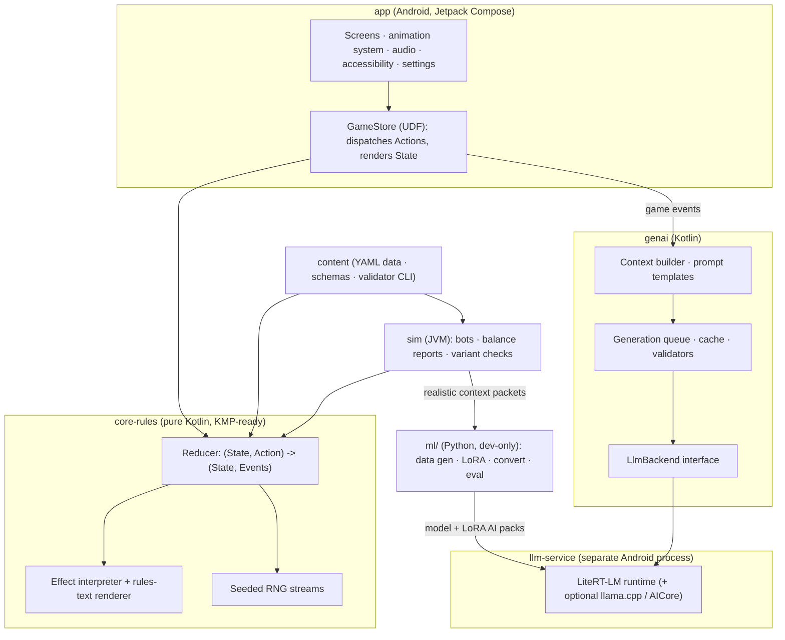
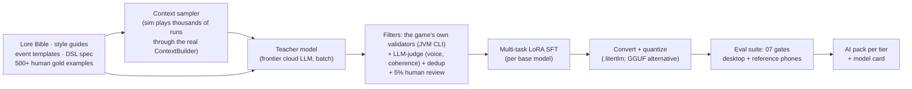

# 09: Technical Architecture

This document records the recommended stack and system design for implementation. It covers the structure and the key decisions, not code. It is a starting point to be validated by the Phase 1–3 prototypes ([10](10-roadmap.md)).

**Summary:**

- **Platform:** Kotlin, Android-first, ready for Kotlin Multiplatform.
- **UI:** Jetpack Compose.
- **Rules engine:** pure Kotlin and deterministic.
- **On-device LLM:** **LiteRT-LM** behind a swappable backend interface.
- **Models:** delivered through **Play for On-device AI**.
- **Fine-tuning:** a dev-time Python pipeline for LoRA fine-tunes of Gemma-family models.

---

## Stack Decision (ADR-001)

**Context.** We need:

- a 2D, UI-heavy card game on Android, played in portrait
- on-device LLM inference as a first-class feature
- a deterministic rules engine that runs headless for simulation, validation and replays
- a codebase that will largely be built with AI-assisted development

| Criterion | **Kotlin + Compose** | Godot 4 | Unity |
|---|---|---|---|
| On-device LLM integration | **First-class.** LiteRT-LM Kotlin API, ML Kit GenAI and AICore are native. | Via GDExtension or an Android plugin (llama.cpp-based plugins exist) | Via native plugins (llama.cpp-based packages exist) or JNI to LiteRT-LM |
| AI-assisted development | **Excellent.** Everything is plain code. | Good. Scenes are text (`.tscn`). | Weaker. Editor-centric, with serialized assets. |
| Headless simulation and CI tests | **Trivial.** The engine is a JVM library. | Possible (headless mode) | Possible (batchmode), heavier |
| 2D game feel (VFX, particles, juice) | Needs a small in-house toolkit (Canvas, AGSL shaders on Android 13+) | **Strong** | **Strong** |
| Portability | Android first. Desktop and iOS later via Compose Multiplatform. | All platforms | All platforms |
| APK size and startup | **Smallest** | Small | Larger |
| Licensing | Open source | Open source (MIT) | Proprietary; terms have changed before |

**Decision: Kotlin + Jetpack Compose**, with the rules engine as a pure-Kotlin module.

**Consequences:**

- We build a small animation and VFX toolkit: card motion, Track animations, particles on Canvas, and AGSL shaders for the "branch" look, with a static fallback below Android 13.
- Phase 2 includes a **VFX spike** with a go/no-go checkpoint. **Godot 4 is the runner-up** if game feel can't reach the bar.
- A desktop build (for Steam) and iOS remain possible later through Compose Multiplatform, and LiteRT-LM also targets desktop and iOS.

---

## System Overview



| Module | Responsibility |
|---|---|
| `core-rules` | Game state, the action reducer, combat (zones, energy, Track), run (Timestream, Anchors, Paradox, ledger), DSL interpreter, rules-text rendering, RNG streams, serialization. **No Android dependencies.** |
| `content` | Cards, enemies, events, Artifacts, Imprints, Lore Bible snippets, Misprint tables, and authored fallback text, as YAML compiled to a binary bundle. Also the **validator CLI** (schemas, budgets, references). |
| `sim` | Headless JVM simulator with bots (greedy heuristic and MCTS for combat) for balance reports, Pressure and Delay abuse detection, and calibrating the [08](08-card-dsl.md) cost table |
| `genai` | The `LlmBackend` interface, context builder, versioned prompt templates, the generation queue, the cache, all validators ([07](07-genai-design.md#validation-layers)), and fallbacks |
| `llm-service` | A bound service in its own process (`:llm`) that hosts the inference runtime. Isolates memory pressure and crashes from the game. |
| `app` | Compose UI, navigation, animation event queue, audio and haptics, persistence, settings, TalkBack semantics, localization |
| `ml/` | Dev-time Python pipeline (not shipped): data generation, LoRA training, conversion, quantization, evaluation |

---

## Rules Engine

- **Unidirectional data flow.**
  - The UI dispatches `Action`s, such as `PlayCard`, `UseSignature`, `Borrow`, `ChooseMoment` and `Rewind`.
  - The pure reducer returns a new `State` plus a list of `GameEvent`s: `DamageDealt`, `IntentDelayed`, `ParadoxChanged` and so on.
  - The UI animates the events. The genai module listens to them for triggers.
- **Effects are data.** The interpreter executes the DSL from [08](08-card-dsl.md), so authored cards, enemy intents and forged variants all run through one code path.
- **Rules text is rendered from effects** through localized templates, so it can never disagree with behavior.
- **RNG streams.**
  - Separate seeded streams are derived from the run seed with a splittable PRNG: map, rewards, shuffle, enemy AI, Misprint and cosmetic.
  - The UI and the LLM never consume game RNG.
- **Safety caps:**
  - at most 60 card plays per turn
  - at most 200 effect resolutions per action
  - invariants checked in debug builds: HP ≤ max, energy ≥ 0, Track countdowns ≥ 1 until they resolve

## Determinism and Saves

- **A save contains:**
  - the run seed
  - the content version
  - the **action log**
  - a snapshot at every step
  - the generated-text cache
  - recorded model decisions (Select and Compose results)
- **Resume** loads the latest snapshot and replays the remaining actions. Model decisions are read from the log, never re-generated.
- **Golden replays in CI:** (seed, actions) must produce a known state hash, which catches accidental nondeterminism.
- **Versioning.** Saves pin the content version, and migrations are explicit. Branch Variants are stored as *(source card ID, VariantPlan)* and re-rendered on load.
- **A future leaderboard** can verify scores by re-simulating a submitted seed and action log on a server, because the engine is deterministic.

---

## LLM Runtime

```kotlin
interface LlmBackend {
    val info: BackendInfo                         // model id + version, adapter, tier, capabilities
    suspend fun generate(req: GenRequest): GenResult
    fun stream(req: GenRequest): Flow<GenChunk>   // used by the Run Chronicle typewriter
    fun cancel(requestId: String)
}

data class GenRequest(
    val id: String,
    val task: Task,              // NARRATE_EVENT, CHRONICLE, BARKS, VARIANT_PLAN, SELECT_RIPPLE, ...
    val prefixKey: String,       // static prefix id, so its KV cache can be reused
    val packet: String,          // the dynamic context packet
    val schema: JsonSchema?,     // constrained decoding (JSON Schema or enum)
    val maxTokens: Int,
    val sampling: Sampling,      // per-task temperature / top-p; near-greedy for Select
    val deadlineMs: Long,
)
```

| Backend | Role | Notes |
|---|---|---|
| **LiteRtLmBackend** | Primary | Google's LiteRT-LM: Kotlin API for Android and JVM, GPU/NPU acceleration, **constrained decoding (JSON Schema, regex, Lark grammars, tool calling)**, **LoRA adapters**, cross-platform core. The JVM build also runs the eval suite on desktop. |
| **LlamaCppBackend** | Alternative | GGUF models and GBNF grammars. A wider model choice (for example small Qwen-family models) if a non-LiteRT model wins the benchmarks. Via JNI. |
| **AiCoreBackend** | Optional | Android's system model (Gemini Nano via the ML Kit GenAI Prompt API) on supported devices. It needs no download, but it can't take our LoRA, so it is prompt-only and covers the Lite features. AICore's 2026 developer preview is adding structured output and tool calling. |
| **FallbackBackend** | Always present | Authored, procedural and seeded outputs. It is what "Off" mode uses. |

- **Process isolation.** The runtime lives in the `:llm` process. The game talks to it through a bound service with small payloads, and generation time dwarfs the IPC cost.
  - The model is unloaded on `onTrimMemory` or when the app goes to the background.
  - It is reloaded lazily on the next prefetch.
- **Prefix caching.** Each task's static prefix (system rules, schema, style guide) is pre-filled once per session, and its KV cache is reused.
- **Sampling per task:**

| Task | Temperature |
|---|---|
| Narration | ≈ 0.8 |
| Chronicle | ≈ 0.85 |
| Barks | ≈ 0.9 |
| Compose | ≈ 0.6 |
| Select | ≈ 0.2 (near-greedy, enum-constrained) |

## Device Tiers

| Tier | Device criteria | Model (candidate) | Chronicler default |
|---|---|---|---|
| **A** | ≥ 8 GB RAM and a LiteRT-LM-supported GPU or NPU | **Gemma 4 E2B**, text-only, with Google's mixed 2/4/8-bit mobile quantization (≈ 0.8 GB resident weights, embeddings memory-mapped), plus our multi-task LoRA | **Full** |
| **B** | 6–8 GB RAM | A ~1B-class model, for example **Gemma 3 1B int4** (≈ 0.5–0.7 GB), plus our LoRA | **Lite** |
| **C** | < 6 GB RAM, or no model downloaded | None | **Off** (fully playable) |
| *Ultra (opt-in)* | Flagships | Gemma 4 E4B, for richer prose | Full |

- **Published reference point.** Gemma 4 E2B on LiteRT-LM on a 2026 flagship (Galaxy S26 Ultra):
  - **≈ 52 tokens/s decode and 0.3 s time-to-first-token on GPU**
  - ≈ 47 tokens/s decode on CPU
  - multi-token prediction raises decode speed further ([references](#references))
- **Classification** happens at first launch: RAM, then an SoC allowlist, then a 10-second micro-benchmark after the model downloads. Players can override it in Settings.
- **Final model picks** come from Phase 3–4 benchmarks on reference devices (one flagship, one mid-range, one budget). The candidate list includes Gemma 4 E2B/E4B, Gemma 3 1B/270M, and small Qwen-family models.

## Performance Budgets

| Budget | Target |
|---|---|
| App RAM (excluding model) | ≤ 450 MB |
| Model process RAM | ≤ 1.6 GB (Tier A) · ≤ 0.9 GB (Tier B) |
| Time to first token | ≤ 1 s (Tier A, GPU or NPU) · ≤ 2.5 s (Tier B) |
| Decode speed | ≥ 15 tokens/s (Tier A minimum) · ≥ 8 tokens/s (Tier B) |
| Generation per full run | ≈ 5k output tokens, spread across natural pauses ([07](07-genai-design.md#context-packets)) |
| UI | 60 fps. During generation, no more than 5% of frames over budget. |
| Battery | ≤ 8% per hour of play on the Tier A reference device, with Full mode |
| Download | Base APK < 150 MB. The model pack is separate and optional (Tier A ≈ 1.5–2 GB, Tier B ≈ 0.6 GB; confirm in Phase 3). |

## Model Delivery

**Play for On-device AI** delivers models as **AI packs**:

- **Delivery mode.** AI packs support install-time, fast-follow and on-demand delivery. We use **on-demand**: a first-run screen offers the download, shows the size, and defaults to Wi-Fi only. It can also be started later from Settings.
- **Device targeting.** Each device receives only its tier's model.
- **Independent updates.** Packs update separately from the app, and Play only re-downloads packs that changed. AI packs can't contain code, so our code ships in the app.
- **Integrity.** We hash-check every pack, and the game runs as Tier C until the model is ready.
- **Cache safety.** The generated-text cache is keyed by model version, so updating the model never rewrites old saves.

---

## Fine-Tuning Pipeline

All of this happens at **dev time**. Nothing here ships to players, and the shipped game makes no network calls.



1. **Sources of truth.** The Lore Bible (structured YAML), faction voice guides, event templates, the DSL spec with its allowed-ops tables, and **500 or more human-written gold examples** across all tasks.
2. **Context sampling.** The simulator plays thousands of bot runs. The **same `ContextBuilder` code the game uses** turns them into realistic packets: ledgers, decks, events, Divergences. Training packets therefore match production packets exactly.
3. **Teacher generation.**
   - A frontier cloud model writes target outputs for the packets, using a batch API to keep costs down.
   - Target: about **30–60k examples** across the tasks NARRATE_EVENT, CHRONICLE, BARKS, VARIANT_PLAN, SELECT_* and EXPLAIN.
   - *Before starting, confirm that the teacher provider's terms allow using its outputs to fine-tune our model.*
4. **Filtering.**
   - Every example must pass the **exact validators the game uses**, run through the JVM CLI.
   - An LLM-judge scores voice and coherence.
   - Near-duplicates are removed, and humans spot-check 5%.
   - The final set is balanced by task, era and faction.
5. **Training.**
   - One **multi-task LoRA** per base model, with a task tag in each prompt. We use standard open tooling (Hugging Face TRL/PEFT or Unsloth).
   - Starting point: rank 16–32, 2–3 epochs. Tuned against the eval suite.
6. **Conversion.**
   - Export to LiteRT-LM's `.litertlm` format with Google AI Edge tooling.
   - Keep the LoRA as a runtime adapter where supported, or merge it before quantization.
   - For the alternative backend, produce GGUF with llama.cpp quantization.
7. **Evaluation.** The [07](07-genai-design.md#evaluation) gates, run on desktop (LiteRT-LM JVM) and on each tier's reference phone (latency, memory, thermal).
8. **Packaging.** One AI pack per tier, plus a **model card**: data provenance, eval results, known limitations, and license.

- **Licensing.** Track each base model's license in `ml/MODEL_LICENSES.md`. Gemma 4 was released under Apache 2.0; re-verify for every model actually shipped.

---

## Testing and QA

| Layer | What |
|---|---|
| Unit tests | Every keyword, status and Track rule in [04](04-combat.md), table-driven |
| Property tests | Invariants under random action sequences: no negative energy, countdowns ≥ 1 until they resolve, no infinite loops, conservation of cards across zones |
| Golden replays | Seed and action log produce a known state hash, for every content version |
| Content CI | The validator CLI checks every card's schema, budget ([08](08-card-dsl.md#budget-targets)) and references, and every event's choice IDs |
| Simulation (nightly) | Bot win rates per operative and Entropy level; card pick-rate versus win-rate; **abuse detectors** (for example the share of turns ending in Delay, average Pressure at resolution, Paradox at Unravel); Forge variant strength versus the source card |
| LLM eval | The [07](07-genai-design.md#evaluation) gates on every model, adapter or prompt change |
| UI | Compose UI tests for the core flows, and screenshot tests for card rendering |
| Device lab | Per-tier performance, thermal and memory runs (Firebase Test Lab plus physical reference phones) |
| Accessibility | Scripted TalkBack passes through a full combat and a full Timestream step |

## Security and Privacy

- No account and no server are required. Analytics are opt-in, anonymous, and never include generated text unless a player sends a report.
- AI packs are integrity-checked. Prompts are built only from game state and curated lore; there is no free-text input.
- Anti-cheat isn't a priority for a single-player game. Future leaderboards would use server-side replay verification.

## Repository Layout (planned)

```
/app            Android app (Jetpack Compose UI)
/core-rules     Pure Kotlin rules engine (KMP-ready)
/content        Card/enemy/event data, schemas, validator CLI
/genai          LLM abstraction, context builder, validators, queue, cache
/llm-service    Bound service hosting the inference runtime (separate process)
/sim            Headless simulator + bots (JVM)
/ml             Python: data generation, LoRA training, conversion, eval (dev only)
/docs           These documents
```

---

## References

- LiteRT-LM on Android (Kotlin API, constrained decoding, LoRA): <https://developers.google.com/edge/litert-lm/android>
- Gemma 4 E2B on LiteRT-LM, model card: <https://huggingface.co/litert-community/gemma-4-E2B-it-litert-lm>
- LiteRT-LM and Gemma 4 performance (InfoQ, June 2026): <https://infoq.com/news/2026/06/google-litertlm-gemma4>
- Gemma 4 release overview: <https://www.buildfastwithai.com/blogs/google-gemma-4-open-model>
- AICore developer preview (2026): <https://android-developers.googleblog.com/2026/04/AI-Core-Developer-Preview.html>
- Play for On-device AI (Google I/O 2025 update): <https://android-developers.googleblog.com/2025/06/top-3-updates-for-ai-on-android-google-io.html>
- Google Play, safe AI experiences and AI-generated content policy: <https://android-developers.googleblog.com/2024/06/enabling-safe-ai-experiences.html>
